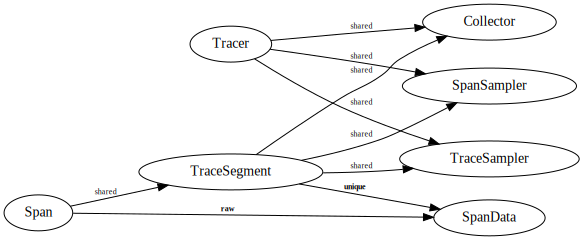

Logical Component Relationships
-------------------------------
- Vertices are components.
- Edges are ownership relationships between components.  Each edge is labeled
  by the kind of "smart pointer" that could implement that kind of
  relationship.
- Components containing a padlock are protected by a mutex.

Objects
-------
- _Span_ has a beginning, end, and tags.  It is associated with a _TraceSegment_.
- _TraceSegment_ is part of a trace.  It makes sampling decisions, detects when
  it is finished, and sends itself to the _Collector_.
- _Collector_ receives trace segments.  It provides a callback to deliver
  sampler modifications, if applicable.
- _Tracer_ is responsible for creating trace segments. It contains the
  instances of, and configuration for, the _Collector_, _TraceSampler_, and
  _SpanSampler_.  A tracer is created from a _TracerConfig_.
- _TraceSampler_ is used by trace segments to decide when to keep or drop
  themselves.
- _SpanSampler_ is used by trace segments to decide which spans to keep when
  the segment is dropped.
- _TracerConfig_ contains all of the information needed to configure the collector,
  trace sampler, and span sampler, as well as defaults for span properties.

Intended usage is:

1. Create a `TracerConfig`.
2. Use the `TracerConfig` to create a `Tracer`.
3. Use the `Tracer` to create and/or extract local root `Span`s.
4. Use `Span` to create children and/or inject context.
5. Use a `Span`'s `TraceSegment` to perform trace-wide operations.
6. When all `Span`s in ` TraceSegment` are finished, the segment is sent to the
   `Collector`.

Different instances of `Tracer` are independent of each other.  If an
application wishes to reconfigure tracing at runtime, it can create another
`Tracer` using the new configuration.

[1]: https://datadog.github.io/dd-trace-cpp/datadog
