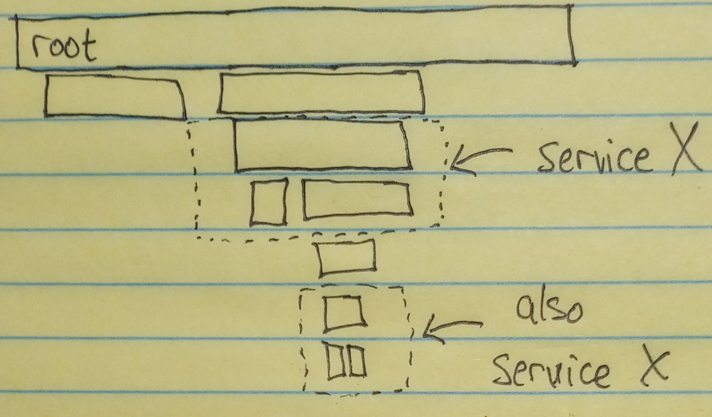

Care and Feeding of Your New Tracing Library
============================================
Congratulations! You are now the proud owner of a distributed tracing library.

The primary purpose of this guide is to describe salient features of the
library's design. dd-trace-cpp differs considerably from its [older sibling][1]
and [peers][2].

This guide will also cover operations performed by maintainers of the library,
such as scooping the box, applying flea medication, and regular trips to the
vet.

Design
------

### Span
[class Span][3] is the component with which users will interact the most.
Each span:

- has an "ID,"
- is associated with a "trace ID,"
- is associated with a "service," which has a "service type," a "version," and
  an "environment,"
- has a "name" (sometimes called the "operation name"),
- has a "resource name," which is a description of the thing that the span is
  about,
- contains information about whether an error occurred during the represented
  operation, including an error message, error type, and stack trace,
- includes an arbitrary name/value mapping of strings, called "tags,"
- has a start time indicating when the represented operation began,
- has a duration indicating how long the represented operation took to finish.

Aside from setting and retrieving its attributes, `Span` also has the following
operations:

- `parent.create_child(...)` returns a new `Span` that is a child of `parent`.
- `span.inject(writer)` writes trace propagation information to a
  [DictWriter][11], which is an interface for setting a name/value mapping, e.g.
  in HTTP request headers.

A `Span` does not own its data. `class Span` contains a raw pointer to a [class
SpanData][4], which contains the actual attributes of the span. The `SpanData`
is owned by a `TraceSegment`, which is described in the next section. The
`Span` holds a `shared_ptr` to its `TraceSegment`.

By default, a span's start time is when it is created, and its end time (from
which its duration is calculated) is when it is destroyed. However, a span's
start time can be specified when it is created, via `SpanConfig::start` (see
[span_config.h][5]), and a span's end time can be overridden via
`Span::set_end_time`.

When a span is destroyed, it is considered "finished" and notifies its
`TraceSegment`. There is no way to "finish" a span without destroying it. You
can override its end time throughout the lifetime of the `Span` object, but a
`TraceSegment` does not consider the span finished until the `Span` object is
destroyed. This allows us to avoid "finished" `Span` states.

Along similar lines, `class Span` is move-only. Its copy constructor is deleted.
Functions that produce spans return them by value, but only one copy of a span
can exist at a time. In fact, `class Span` is even more strict than move-only:
its assignment operator is deleted, including the move-assignment operator. To
see why, consider the following (disallowed) example:
```c++
Span span = tracer.create_span();
// ...
// Let's reuse the variable `span`.
span = tracer.create_span();
```
Move assignment begins with two objects and ends up with one object (and one
empty shell of an object).

Since destroying a `Span` has the side effect of finishing it, one sensible
definition of `Span::operator=(Span&& other)` would be equivalent to:
```c++
this->~Span();
new (this) Span(std::move(other));
return *this;
```
This would have the potentially surprising feature of _finishing_ the first span
when you wish to replace it with another, i.e. there would always be two spans.

This could be avoided if we could guarantee that the two `Span`s belong to the
same `TraceSegment`. Then move-assigning a `Span` could be defined as
move-assigning its `SpanData` and somehow annotating the moved-from `SpanData`
as being invalid.  However, if the two `Span`s belong to different
`TraceSegment`s, then it could be that the moved-to `Span`'s `TraceSegment`
consists of only that one `Span`. Now we have to account for empty
`TraceSegment` states. This could all be dealt with, but no matter what we
decide, it would always be the case that `Span::operator=(Span&&)` has the
effect of making the original span (`this`) either finish implicitly or
_disappear entirely_, which is at odds with its otherwise [RAII][6] nature.

To avoid these issues, assignment to `Span` objects is disallowed.

Another opinionated property of `Span` is that it is not an interface, nor does
it implement an interface. Usually it is considered polite for a C++ library to
deal in handles (`unique_ptr` or `shared_ptr`) to interfaces, i.e. classes that
contain pure virtual functions. This way, a client of the library can substitute
an alternative implementation to the interface(s) for testing or for when the
behavior of the library is not desired.

At the risk of being impolite, dd-trace-cpp takes a different approach. `Span`
is a concrete type whose behavior cannot be substituted. Instead, there are
other places in the library where dependency injection can be used to restrict
or alter the behavior of the library. The trade-off is that `Span` and related
components must always "go through the motions" of their definitions and cannot
be completely customized, but in exchange the indirection, pointer semantics,
and null states that accompany handle-to-interface are avoided.

### Trace Segment
A "trace" is the entire tree of spans having the same trace ID.

Within one process/worker/service, though, typically there is not an entire
trace but only part of the trace. Let's call the process/worker/service a
"tracer."

One portion of a trace that's passing through the tracer is called a "trace
segment." A trace segment begins either at the trace's root span or at a span
extracted from trace context, e.g. a span created from the `X-Datadog-Trace-Id`
and `X-Datadog-Parent-Id` HTTP request headers. The trace segment includes all
local descendants of that span, and has as its "boundary" any descendant spans
without children or descendant spans that were used to inject trace context
out-of-tracer, e.g. in outgoing HTTP request headers.

There might be more than one trace segment for the _same trace_ within a tracer
at the same time. Consider the diagram below.



If our tracer is "service X," then this trace passes through the tracer twice.
We would have two concurrent trace segments for the same trace.

`class TraceSegment` is defined in [trace_segment.h][7]. `TraceSegment` objects
are managed internally by the library. That is to say, a user never creates a
`TraceSegment`.

The library creates a `TraceSegment` whenever a new trace is created or when
trace context is extracted. This is the job of `class Tracer`, described in the
next section.

Primarily, `TraceSegment` is a bag of spans. It contains a
`vector<unique_ptr<SpanData>>`. `Span` objects then refer to the `SpanData`
objects via raw pointers. Now that I think about it, `deque<SpanData>` would
work just as well.

When one of a trace segment's spans creates a child, the child is registered
with the trace segment. When a span is finished, the trace segment is notified.
The trace segment keeps track of how many spans it contains (the size of its
`vector`) and how many spans are finished. When the two numbers are equal, the
trace segment is finished.

When a trace segment is finished, it performs some finalization logic in order
to prepare its spans for submission to the `Collector`. Then it moves its spans
into the collector via `Collector::send`, and a short time later the trace
segment is destroyed. See `TraceSegment::span_finished` in
[trace_segment.cpp][8]. `Collector` is described in a subsequent section.

A `TraceSegment` contains `shared_ptr`s to everything that it needs in order to
do its job. Those objects are created by `class Tracer` when the tracer is
configured, and then shared with `TraceSegment` when the `TraceSegment` is
created.

### Tracer
`class Tracer` is what users configure, and it is how `Span`s are extracted from
trace context or created as a trace's root. See [tracer.h][9].

`Tracer` has two member functions:

- `create_span(...)`
- `extract_span(...)`

and another that combines them:

- `extract_or_create_span(...)`.

All of these result in the creation of a new `TraceSegment` (or otherwise return
an error). The `Tracer`'s data members, which were initialized based on the
tracer's configuration, are copied into the `TraceSegment` so that the
`TraceSegment` can operate independently.

Note how `create_span` never fails. This is a nice property. `extract_span`
_can_ fail.

The bulk of `Tracer`'s implementation is `extract_span`. The other substantial
work is configuration, which is handled by `finalize_config(const
TracerConfig&)`, declared in [tracer_config.h][10]. Configuration will be
described in more depth in a subsequent section.

### Collector
`class Collector` is an interface for sending a `TraceSegment`'s spans somewhere
once they're all done. It's defined in [collector.h][12].

It's just one function: `send`. More of a callback than an interface.

A `Collector` is either created by `Tracer` or injected into its configuration.
The `Collector` instance is then shared with all `TraceSegment`s created by the
`Tracer`. The only thing that a `TraceSegment` does with the `Collector` is call
`send` once the segment is finished.

The default implementation is `DatadogAgent`, which is described in the next
section.

### DatadogAgent
`class DatadogAgent` is the default implementation of `Collector`. It's defined
in [datadog_agent.h][13].

`DatadogAgent` sends trace segments to the [Datadog Agent][14] in batches that
are flushed periodically. In order to do this, `DatadogAgent` needs a means to
make HTTP requests and a means to set a timer for the flush operation. So,
there are two interfaces: [HTTPClient][15] and [EventScheduler][16].

The `HTTPClient` and `EventScheduler` can be injected as part of
`DatadogAgent`'s [configuration][17], which is usually specified via the `agent`
member of `Tracer`'s [configuration][10]. If they're not specified, then default
implementations are used:

- [class Curl : public HTTPClient][18], which uses libcurl's [multi
  interface][20] together with a dedicated thread as an event loop.
- [class ThreadedEventScheduler : public EventScheduler][19], which uses a
  dedicated thread for executing scheduled events at the correct time.

`DatadogAgent::flush` is periodically called by the event scheduler. `flush`
uses the HTTP client to send a POST request to the Datadog Agent's
[/v0.4/traces][21] endpoint. It's all callback-based.

### HTTPClient
`class HTTPClient` is an interface for sending HTTP requests. It's defined in
[http_client.h][15].

The only kind of HTTP request that the library needs to make, currently, is a
POST to the Datadog Agent's traces endpoint. `HTTPClient` has one member
function for each HTTP method needed — so, currently just the one:
```c++
virtual Expected<void> post(const URL& url, HeadersSetter set_headers,
                            std::string body, ResponseHandler on_response,
                            ErrorHandler on_error) = 0;
```
It's callback-based. `post` returns almost immediately. It invokes `set_headers`
before returning, in order to get the HTTP request headers. The request `body`
is moved elsewhere for later processing. One of `on_response` or `on_error` will
eventually be called, depending on whether a response was received or if an
error occurred before a response was received. If something goes wrong setting
up the request, then `post` returns an error. If `post` returns an error, then
neither of `on_response` nor `on_error` will be called.

`HTTPClient` also has another member function:
```c++
virtual void drain(std::chrono::steady_clock::time_point deadline) = 0;
```
`drain` waits for any in-flight requests to finish, blocking up until no later
than `deadline`. It's used to ensure "clean shutdown." Without it, on average
the last one second of traces would be lost on shutdown. Implementations of
`HTTPClient` that don't have a dedicated thread need not support `drain`; in
those cases, `drain` returns immediately.

The default implementation of `HTTPClient` is [class Curl : public
HTTPClient][18], which uses libcurl's [multi interface][20] together with a
dedicated thread as an event loop.

`class Curl` is also used within NGINX in Datadog's NGINX module,
[nginx-datadog][22]. This is explicitly [discouraged][23] in NGINX's developer
documentation, but libcurl-with-a-thread is widely used within NGINX modules
regardless. One improvement that I am exploring is to use libcurl's
"[multi_socket][24]" mode, which allows libcurl to utilize someone else's event
loop, obviating the need for another thread. libcurl can then be made to use
NGINX's event loop, as is done in [an example library][25].

For now, though, nginx-datadog uses the threaded `class Curl`.

[Envoy's Datadog tracing integration][26] uses a different implementation,
[class AgentHTTPClient : public HTTPClient, ...][27], which uses Envoy's
built-in HTTP facilities. libcurl is not involved at all.

### EventScheduler
As of this writing, `class DatadogAgent` flushes batches of finished trace
segments to the Datadog Agent once every two second [by default][28].

It does this by scheduling a recurring event with an `EventScheduler`, which is
an interface defined in [event_scheduler.h][16].

`EventScheduler` has one member function:
```c++
virtual Cancel schedule_recurring_event(
    std::chrono::steady_clock::duration interval,
    std::function<void()> callback) = 0;
```
Every `interval`, the scheduler will invoke `callback`, starting an initial
`interval` after `schedule_recurring_event` is called. The caller can invoke the
returned `Cancel` to prevent subsequent invocations of `callback`.

The default implementation of `EventScheduler` is [class ThreadedEventScheduler
: public EventScheduler][19], which uses a dedicated thread for executing
scheduled events at the correct time. It was a fun piece of code to write.

Datadog's NGINX module, [nginx-datadog][22] uses a different implementation,
[class NgxEventScheduler : public EventScheduler][29], which uses NGINX's own
event loop instead of a dedicated thread.

[Envoy's Datadog tracing integration][26] also uses a different implementation,
[class EventScheduler : public EventScheduler][30], which uses Envoy's built-in
event dispatch facilities.

### Configuration
There's a good [blog post][32] by [Alexis King][31] where she makes the case for
encoding configuration validation into the type system. Forbid invalid states by
making configurable components accept a different type than that which is used
to specify configuration.

This is not a new idea. It's been used, for example, to "taint" strings that
originate as program inputs. Then you can't accidentally pass user-influenced
inputs to, say, `std::system`, because `std::system` takes a `const char*`, not
a `class UserTaintedString`. There's still ample opportunity to cast away the
taint and sneak it into some string building operation, but at least `class
UserTaintedString` gives hope that a static analysis tool could be used to fill
in some gaps in human code review.

This library adopts that approach for configuration. The configuration of `class
Tracer` is `class TracerConfig`, but in order to construct a `Tracer` you must
first convert the `TracerConfig` into a `FinalizedTracerConfig` by calling
`finalize_config`. If there is anything wrong with the `TracerConfig` or with
environment variables that would override it, `finalize_config` will return an
`Error` instead of a `FinalizedTracerConfig`. In that case, you can't create a
`Tracer` at all.

This technique applies to multiple components:

| Component | Unvalidated | Validated | Parser |
| --------------- | ----------- | --------- | ----------------- |
| `Tracer` | `TracerConfig` | `FinalizedTracerConfig` | `finalize_config` in [tracer_config.h][10] |
| `DatadogAgent` | `DatadogAgentConfig` | `FinalizedDatadogAgentConfig` |  `finalize_config` in [datadog_agent_config.h][17] |
| `TraceSampler` | `TraceSamplerConfig` | `FinalizedTraceSamplerConfig` |  `finalize_config` in [trace_sampler_config.h][33] |
| `SpanSampler` | `SpanSamplerConfig` | `FinalizedSpanSamplerConfig` |  `finalize_config` in [span_sampler_config.h][34] |
| multiple | `double` | `Rate` | `Rate::from` in [rate.h][35] |

An alternative approach, that Caleb espouses, is to accept invalid configuration
quietly. When invalid configuration is detected, the library could substitute a
reasonable default and then send notice of the configuration issue to Datadog,
e.g. as a hidden span tag. That information would then be available to Support
should the customer raise an issue due to a difference in behavior between what
they see and what they think they configured. This approach is also resilient to
dynamic configuration changes. Rather than a "bad config update" causing tracing
to cease completely, instead tracing could continue to operate in the defaulted
mode.

This library uses the stricter approach. The downside is that a user of the
library has to decide what to do when even the slightest part of the
configuration or environment is deemed invalid.

One other convention of the library is that `FinalizedFooConfig` (for some
`Foo`) is never a data member of the configured component class. That is,
`FinalizedTracerConfig` is not stored in `Tracer`. Instead, a constructor might
individually copy the finalized config's data members. This is to prevent
eventual intermixing between the "configuration representation" and the "runtime
representation." In part, `finalize_config` already mitigates the problem.
Abstaining from storing the finalized config as a data member is a step further.

### Error Handling
Most error scenarios within this library are individually enumerated by `enum
Error::Code`, defined in [error.h][36].

As of this writing, some of the error codes are emitted in more than one place,
but most of them are emitted in only one place, as is illustrated by the
following incomprehensible command shell pipeline:
```
david@ein:~/src/dd-trace-cpp/src/datadog$ sed -n 's/^\s*\(\w\+\)\s*=\s*[0-9]\+,\?\s*$/{Error::\1/p' error.h | paste -d '|' -s | xargs git grep -P | sed -n 's/.*Error::\(\w\+\),.*/\1/p' | sort | uniq -c | sort -rn
      3 MESSAGEPACK_ENCODE_FAILURE
      2 MAX_PER_SECOND_OUT_OF_RANGE
      2 INVALID_INTEGER
      2 INVALID_DOUBLE
      2 CURL_REQUEST_SETUP_FAILED
      2 CURL_HTTP_CLIENT_ERROR
      1 ZERO_TRACE_ID
      1 URL_UNSUPPORTED_SCHEME
      1 URL_UNIX_DOMAIN_SOCKET_PATH_NOT_ABSOLUTE
      1 URL_MISSING_SEPARATOR
      1 UNKNOWN_PROPAGATION_STYLE
      1 TRACE_SAMPLING_RULES_WRONG_TYPE
      1 TRACE_SAMPLING_RULES_UNKNOWN_PROPERTY
      1 TRACE_SAMPLING_RULES_SAMPLE_RATE_WRONG_TYPE
      1 TRACE_SAMPLING_RULES_INVALID_JSON
      1 TAG_MISSING_SEPARATOR
      1 SPAN_SAMPLING_RULES_WRONG_TYPE
      1 SPAN_SAMPLING_RULES_UNKNOWN_PROPERTY
      1 SPAN_SAMPLING_RULES_SAMPLE_RATE_WRONG_TYPE
      1 SPAN_SAMPLING_RULES_MAX_PER_SECOND_WRONG_TYPE
      1 SPAN_SAMPLING_RULES_INVALID_JSON
      1 SPAN_SAMPLING_RULES_FILE_IO
      1 SERVICE_NAME_REQUIRED
      1 RULE_WRONG_TYPE
      1 RULE_TAG_WRONG_TYPE
      1 RULE_PROPERTY_WRONG_TYPE
      1 RATE_OUT_OF_RANGE
      1 OUT_OF_RANGE_INTEGER
      1 NO_SPAN_TO_EXTRACT
      1 MISSING_TRACE_ID
      1 MISSING_SPAN_INJECTION_STYLE
      1 MISSING_SPAN_EXTRACTION_STYLE
      1 MISSING_PARENT_SPAN_ID
      1 MALFORMED_TRACE_TAGS
      1 DUPLICATE_PROPAGATION_STYLE
      1 DATADOG_AGENT_NULL_HTTP_CLIENT
      1 DATADOG_AGENT_INVALID_FLUSH_INTERVAL
      1 CURL_REQUEST_FAILURE
      1 CURL_HTTP_CLIENT_SETUP_FAILED
      1 CURL_HTTP_CLIENT_NOT_RUNNING
```
The integer values of the enumerated `Error::Code`s are intended to be
permanent. Given an error message from a log mentioning an error code 24, one
can look at the source code for the matching `Error::Code`
(`TAG_MISSING_SEPARATOR`) and then find all of the possible source origins for
that error. At first this seems like a poor substitute for including the source
file and line in the error message, but I suspect that this compromise is
better.

In addition to an error code, each error condition is associated with a
contextual diagnostic message. The diagnostic is not only a description of the
error, but also contains runtime context that might help a user or a maintainer
identify the underlying issue. For example, a message for
`TAG_MISSING_SEPARATOR` might include the text that was being parsed, or mention
the name of the relevant environment variable.

The `Error::Code code` and `std::string message` are combined in a `struct
Error`, which is the error type used by this library.

`struct Error` has a convenience member function, `Error with_prefix(StringView)
const`, that allows context to be added to an error. It's analogous to
`catch`ing one exception and then `throw`ing another, e.g.
```c++
Expected<Cat> adopt_cat(AnimalShelter& shelter) {
  Expected<Cat> result = shelter.adopt(Animals::CAT, 1);
  if (Error *error = result.if_error()) {
    return error->with_prefix("While trying to adopt from AnimalShelter: ");
  }
  return result;
}
```

`struct Error` is most often used in conjunction with the `Expected` class
template, which is defined in [expected.h][37].

`template <typename T> class Expected` is either a `T` or an `Error`. It is a
wrapper around `std::variant<T, Error>`. It's inspired by C++23's
[std::expected][38], but the two are not compatible.

Functions in this library that intend to return a "`Value`," but that might
instead fail with an `Error`, return an `Expected<Value>`.

This library never reports errors by throwing an exception. However, the library
will allow exceptions, such as `std::bad_alloc` and `std::bad_variant_access`,
to pass through it, and does sometimes use exceptions internally. The intention
is that a client of this library does not need to write `catch`. An alternative
design would be to use exceptions for their intended purpose. We decided that,
for a tracing library embedded in proxies, the ergonomics of error values are a
better fit than exceptions.

`Expected` supports two syntaxes of use. The first is [std::get_if][39]-style
unpacking with the `if_error` member function:
```c++
Expected<Salad> lunch = go_buy_lunch();
if (Error *error = lunch.if_error()) {
  return error->with_prefix("Probably getting a hotdog instead: ");
}
eat_salad(*lunch); // or, lunch.value()
```
`if_error` returns a pointer to the `Error` if there is one, otherwise it
returns `nullptr`. The body of a conditional statement such as `if` or `while`
is allowed to contain a variable definition. If the conditional statement
contains a variable definition, then the truth value of the resulting variable
is used as the condition. So, if there is _not_ an error, then `if_error`
returns `nullptr`, and so the declared `Error*` is `nullptr`, which is false for
the purposes of conditionals, and so in that case the body (block) of the
conditional statement is skipped.

`if_error` cannot be called on an [rvalue][40], because allowing this makes it
far too easy to obtain a pointer to a destroyed object. I wrote the component
and nonetheless made this mistake repeatedly. So, the rvalue-flavored overload
of `Expected::if_error` is `delete`d.

The other syntax of use supported by `Expected` is the traditional
check-and-accessor pattern:
```c++
Expected<Salad> lunch = go_buy_lunch();
if (!lunch) {
  return lunch.error().with_prefix("Probably getting halal instead: ");
}
eat_salad(*lunch); // or, lunch.value()
```

`Expected` defines `explicit operator bool`, which is `true` if the `Expected`
contains a non-`Error`, and `false` if the `Expected` contains an `Error`. There
is also `has_value()`, which returns the same thing.

Then the `Error` can be obtained via `error()`, or the non-`Error` can be
obtained via `value()` or `operator*()`.

Why bother with `if_error`? Because I like it! I'm a sucker for structured
bindings and pattern matching.

`template <typename T> class Expected` has one specialization: `Expected<void>`.
`Expected<void>` is "either an `Error` or nothing." It's used to convey the
result of an operation that might fail but that doesn't yield a value when it
succeeds. It behaves in the same way as `Expected<T>`, except that `value()` and
`operator*()` are not defined.

At first I instead used `std::optional<Error>` directly. The problem there was
that `explicit operator bool` has the opposite meaning as it does in
`Expected<T>`. I wanted error handling code to be the same in the two cases, and
so I specialized `Expected<void>`. `Expected<void>` is implemented in terms of
`std::optional<Error>`, but inverts the value of `explicit operator bool`.

### Logging
Can we write a tracing library that does not do any logging by itself? The
previous section describes how errors are reported by the library, and no
logging is involved there. Why not leave it up to the client to decide whether
to note error conditions in the log or to proceed silently?

The problem is that the default implementations of [HTTPClient][15] ([Curl][18])
and [EventScheduler][16] ([ThreadedEventScheduler][19]) do some of their work on
background threads, where error conditions may occur without having a "caller"
to notify, and where execution will proceed despite the error. In those cases,
should the library squelch the error?

One option is for these async components to accept an `on_error(Error)` callback
that will be invoked whenever an error occurs on the background thread that
would not otherwise be reported to client code. What would a client library do
in `on_error`? I think that it would either do nothing or log the error. So, an
`on_error` callback for use in background threads is the same as a logging
interface.

It's tempting to omit a logging interface, leaving it to clients to decide
whether and how to log. Why have logging _and_ error reporting when you can have
just error reporting?

We could do that. Here are three reasons why this library has a logging interface
anyway:

1. Logging a `Tracer`'s configuration when it's initialized is a helpful
   diagnostic tool. A logging interface allows `Tracer` to do this explicitly,
   as opposed to counting on client code to log `Tracer::config_json()` itself.
   A client library can still suppress the startup message in its implementation
   of the logging interface, but this is more opt-out than opt-in.
2. Along the same lines, reporting errors that occur on a background thread by
   invoking a logging interface allows for the library's default behavior to be
   to print an error message to a log, as opposed to having an `on_error`
   callback that a client library might choose to log within.
3. A logging interface allows warnings to be logged, notifying a user of a
   potentially problematic, but valid, configuration. Sometimes these warnings
   are a matter of taste, and sometimes they are required by the specification
   of the feature being configured. Logging is not the only way to handle this —
   imagine if the return value of `finalize_config` included a list of warnings.
   But, as with the previous two points, a logging interface allows for the
   default behavior to be a logged message.

On the other hand, the primary clients of this library are NGINX and Envoy,
where Datadog engineers have a say in how the library is used. So, the
distinction is probably not so important.

The logging interface is `class Logger`, defined in [logger.h][41].

The design of `class Logger` is informed by three constraints:

1. Most "warn," "info," "debug," and "trace" severity logging is noise. It is
   more an artifact of feature development than it is a helpful event with which
   issues can be diagnosed. The logger should have few severity levels, or
   ideally only one.
2. Logging libraries that obscure a conditional branch via the use of
   preprocessor macros are difficult to understand. Reverse engineering a
   composition of preprocessor macros is hard, and is not justified by the
   syntactic convenience that the macros provide.
3. When client code decides that a message will not be logged, the library
   should minimize the amount of computation that is done — as close to nothing
   as is feasible.

(1) and (3) work well together.

On account of (1), `Logger` has only two "severities": "error" and "startup."
`log_startup` is called once by a `Tracer` when it is initialized. `log_error`
is called in all other logging circumstances.

On account of (3), `Logger` must do as little work as possible when an
implementer decides that a logging function should not log. If this library were
to build diagnostic messages in all cases, and then pass them to the `Logger`,
then the cost of building the message would be paid even when the `Logger`
decides not to log. On account of (2), the library cannot define a `DD_LOG`
macro that hides an `if (logger.severity > ...)` branch. As a matter of taste, I
don't want the library to be littered with such branches explicitly.

The compromise is to have `Logger::log_error` and `Logger::log_startup` accept a
[std::function][44] that, if invoked, does the work of building the diagnostic
message. When a `Logger` implementation decides not to log, the only cost paid
at the call site is the construction of the `std::function` and the underlying
capturing lambda expression with which it was likely initialized. The signature
of the `std::function`, aliased as `Logger::LogFunc`, is `void(std::ostream&)`.
I don't know whether this results in a real runtime savings in the not-logging
case, but it seems likely.

`Logger` also has two convenience overloads of `log_error`: one that takes a
`const Error&` and one that takes a `StringView`.

The `const Error&` overload reveals a contradiction in the design. If an `Error`
is produced in a context where its only destiny is to be passed to
`Logger::log_error(const Error&)`, then the cost of building `Error::message`
will always be paid, in violation of constraint (3). One way to avoid this would
be to have versions of the `Error`-returning operations that instead accept a
`Logger&` and use `Logger::log_error(Logger::LogFunc)` directly. I think that
the present state of things is acceptable and that such a change is not
warranted.

The default implementation of `Logger` is `CerrLogger`, defined in
[cerr_logger.h][42]. `CerrLogger` logs to [std::cerr][43] in both `log_error`
and `log_startup`.

The `Logger` used by a `Tracer` is configured via `std::shared_ptr<Logger>
TracerConfig::logger`, defined in [tracer_config.h][10].

Finally, constraint (1) is still a matter of debate. Support representatives
have expressed frustration with this library's, and its predecessor's, lack of a
"debug mode" that logs the reason for every decision made throughout the
processing of a trace. This issue deserves revisiting. Here are some potential
approaches:

- Introduce a "debug mode" that sends fine-grained internal information to
  Datadog, rather than to a log, either as hidden tags on the trace or via a
  different data channel, such as the [Telemetry API][45].
- Introduce a "trace the tracer" mode that generates additional traces that
  represent operations performed by the tracer. This technique was prototyped in
  the [david.goffredo/traception][46] branch.
- Add a `Logger::log_debug` function that optionally prints fine-grained tracing
  information to the log, in violation of constraint (1).

Operations
----------
TODO

### Testing
TODO

### Code Coverage
TODO

### Benchmarks
TODO

### Continuous Integration
TODO

### Releases
TODO

### Support
TODO

[1]: https://github.com/DataDog/dd-opentracing-cpp
[2]: https://github.com/open-telemetry/opentelemetry-cpp
[3]: ../src/datadog/span.h
[4]: ../src/datadog/span_data.h
[5]: ../src/datadog/span_config.h
[6]: https://en.cppreference.com/w/cpp/language/raii
[7]: ../src/datadog/trace_segment.h
[8]: ../src/datadog/trace_segment.cpp
[9]: ../src/datadog/tracer.h
[10]: ../src/datadog/tracer_config.h
[11]: ../src/datadog/dict_writer.h
[12]: ../src/datadog/collector.h
[13]: ../src/datadog/datadog_agent.h
[14]: https://docs.datadoghq.com/agent/
[15]: ../src/datadog/http_client.h
[16]: ../src/datadog/event_scheduler.h
[17]: ../src/datadog/datadog_agent_config.h
[18]: ../src/datadog/curl.h
[19]: ../src/datadog/threaded_event_scheduler.h
[20]: https://curl.se/libcurl/c/libcurl-multi.html
[21]: https://github.com/DataDog/datadog-agent/blob/9d57c10a9eeb3916e661d35dbd23c6e36395a99d/pkg/trace/api/version.go#L22
[22]: https://github.com/DataDog/nginx-datadog
[23]: https://nginx.org/en/docs/dev/development_guide.html#http_requests_to_ext
[24]: https://curl.se/libcurl/c/curl_multi_socket_action.html
[25]: https://github.com/dgoffredo/nginx-curl
[26]: https://github.com/envoyproxy/envoy/tree/main/source/extensions/tracers/datadog#datadog-tracer
[27]: https://github.com/envoyproxy/envoy/blob/main/source/extensions/tracers/datadog/agent_http_client.h
[28]: https://github.com/DataDog/dd-trace-cpp/blob/ca155b3da65c2dc235cf64a28f8e0d8fdab3700c/src/datadog/datadog_agent_config.h#L50-L51
[29]: https://github.com/DataDog/nginx-datadog/blob/master/src/ngx_event_scheduler.h
[30]: https://github.com/envoyproxy/envoy/blob/main/source/extensions/tracers/datadog/event_scheduler.h
[31]: https://lexi-lambda.github.io/about.html
[32]: https://lexi-lambda.github.io/blog/2019/11/05/parse-don-t-validate/
[33]: ../src/datadog/trace_sampler_config.h
[34]: ../src/datadog/span_sampler_config.h
[35]: ../src/datadog/rate.h
[36]: ../src/datadog/error.h
[37]: ../src/datadog/expected.h
[38]: https://en.cppreference.com/w/cpp/utility/expected
[39]: https://en.cppreference.com/w/cpp/utility/variant/get_if
[40]: https://en.cppreference.com/w/cpp/language/value_category
[41]: ../src/datadog/logger.h
[42]: ../src/datadog/cerr_logger.h
[43]: https://en.cppreference.com/w/cpp/io/cerr
[44]: https://en.cppreference.com/w/cpp/utility/functional/function
[45]: https://github.com/DataDog/datadog-agent/blob/796ccb9e92326c85b51f519291e86eb5bc950180/pkg/trace/api/endpoints.go#L97
[46]: https://github.com/DataDog/dd-trace-cpp/tree/david.goffredo/traception
