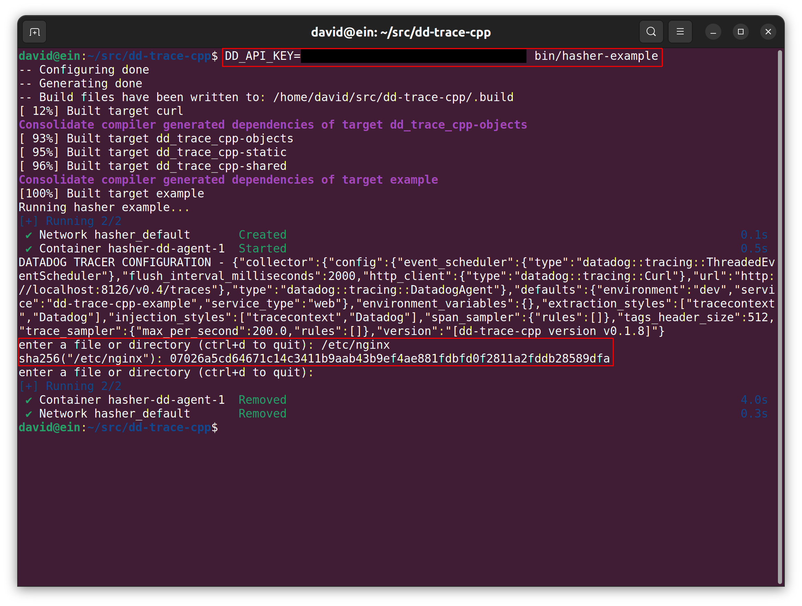
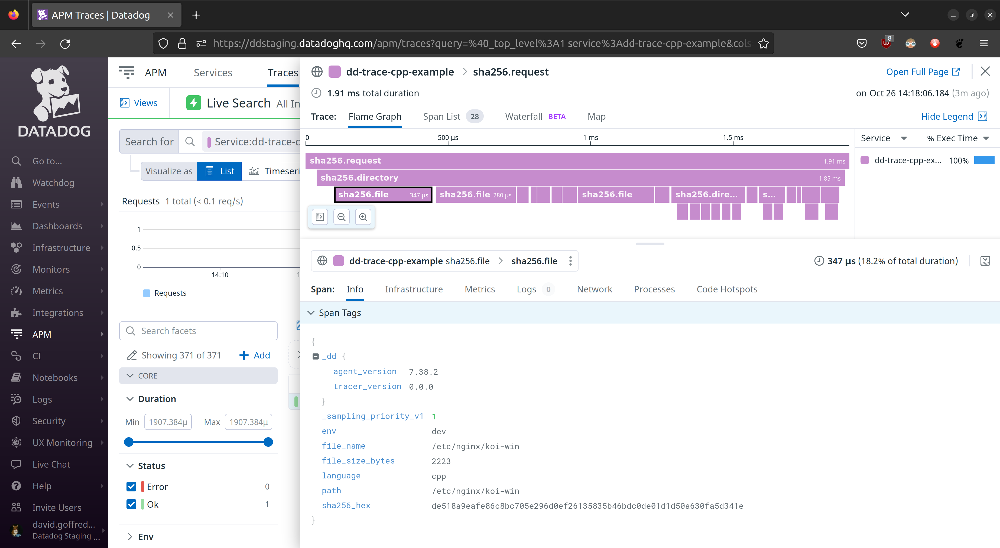

Example Tracing Program
=======================
This is a `docker compose` setup that runs a Datadog Agent and a command line
program that produces traces.

The command line program prompts for the path to a file or directory, and then
walks the directory tree below the specified path, calculating a hash for each
file or directory encountered.

The program produces a trace of this calculation, where each file encountered
is a span whose duration is the time it took to hash the file.

[../bin/hasher-example](../bin/hasher-example) builds and runs this example.

