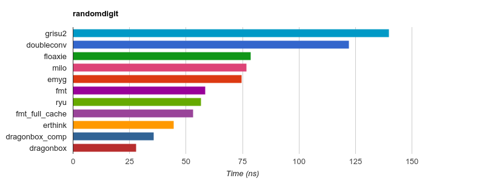
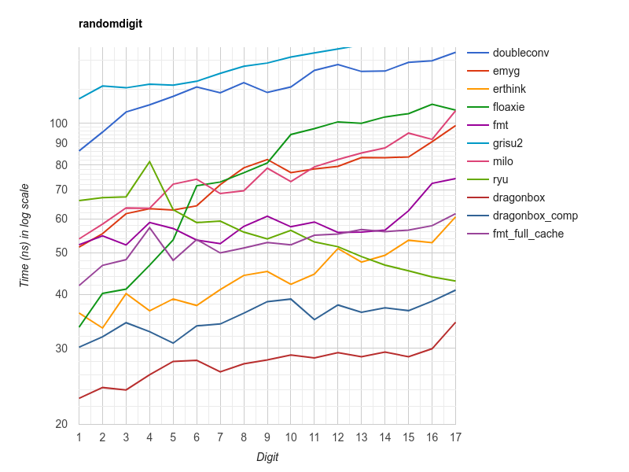
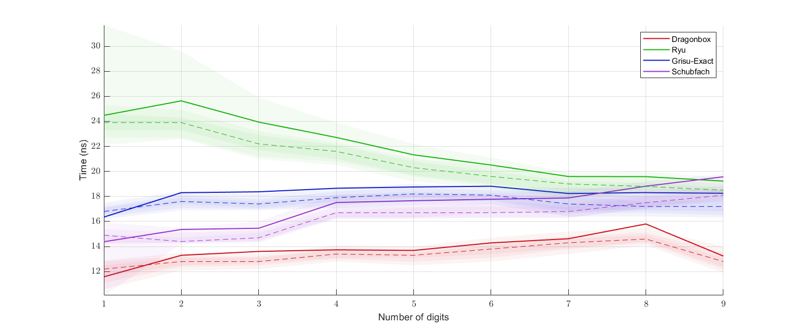
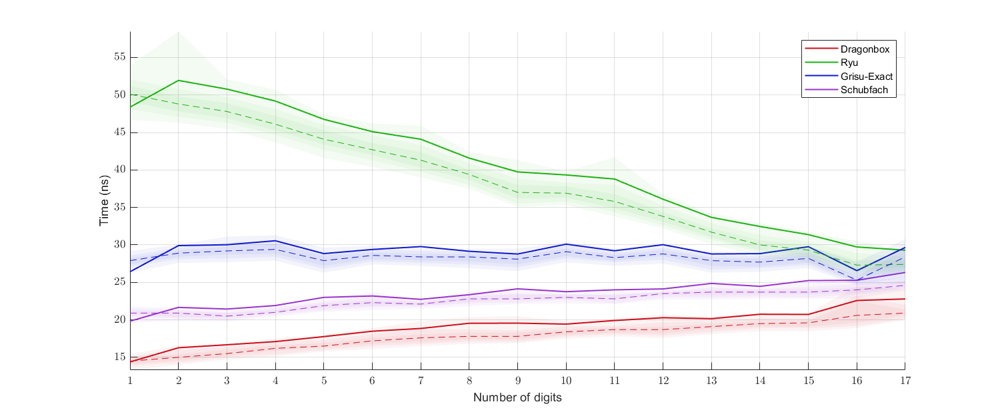
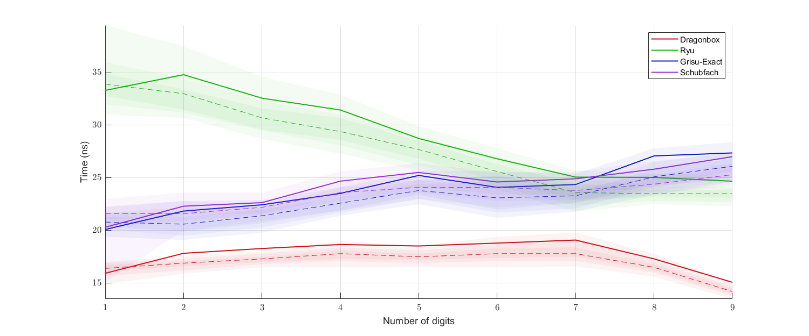
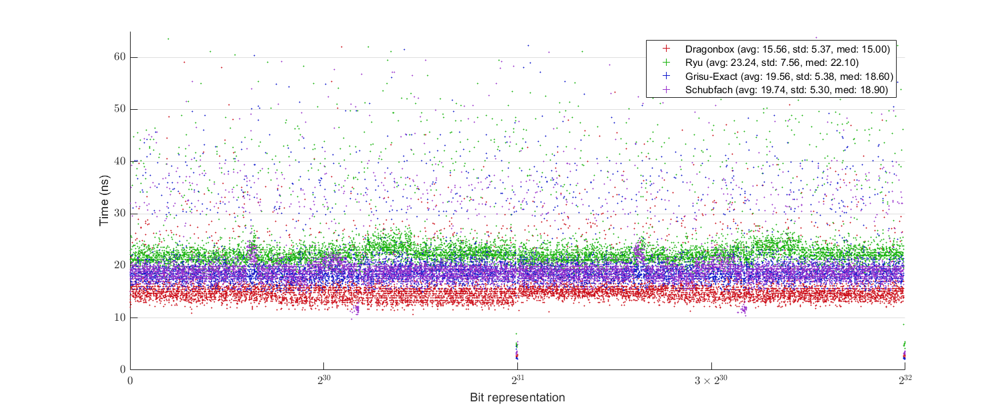
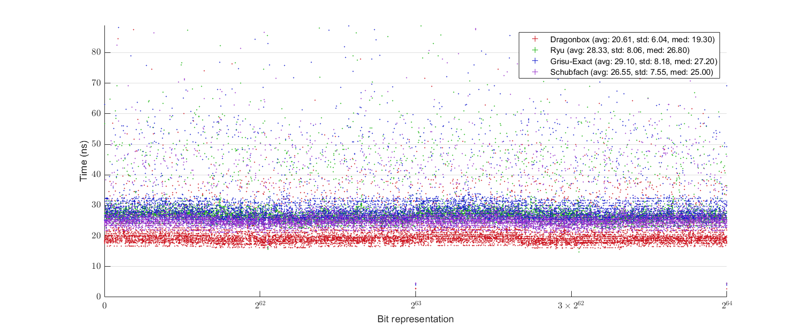
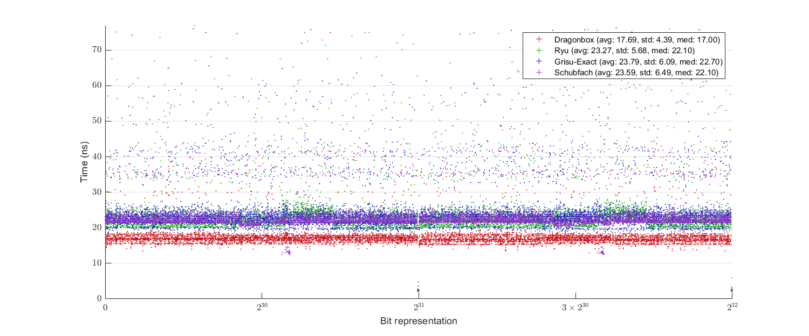

# Dragonbox
This library is a reference implementation of [Dragonbox](other_files/Dragonbox.pdf) in C++.

Dragonbox is a float-to-string conversion algorithm based on a beautiful algorithm [Schubfach](https://drive.google.com/file/d/1IEeATSVnEE6TkrHlCYNY2GjaraBjOT4f/edit), developed by Raffaello Giulietti in 2017-2018. Dragonbox is further inspired by [Grisu](https://www.cs.tufts.edu/~nr/cs257/archive/florian-loitsch/printf.pdf) and [Grisu-Exact](https://github.com/jk-jeon/Grisu-Exact).

# Introduction
Dragonbox generates a pair of integers from a floating-point number: the decimal significand and the decimal exponent of the input floating-point number. These integers can then be used for string generation of decimal representation of the input floating-point number, the procedure commonly called ````ftoa```` or ````dtoa````.

The algorithm guarantees three things:

1) It has the roundtrip guarantee; that is, a correct parser interprets the generated output string as the original input floating-point number. (See [here](https://github.com/jk-jeon/dragonbox/blob/master/README.md#precise-meaning-of-roundtrip-gurantee) for some explanation on this.)

2) The output is of the shortest length; that is, no other output strings that are interpreted as the input number can contain less number of significand digits than the output of Dragonbox.

3) The output is correctly rounded: the number generated by Dragonbox is the closest to the actual value of the input number among possible outputs of minimum number of digits.

# About the Name "Dragonbox"
The core idea of Schubfach, which Dragonbox is based on, is a continuous analogue of discrete [pigeonhole principle](https://en.wikipedia.org/wiki/Pigeonhole_principle). The name *Schubfach* is coming from the German name of the pigeonhole principle, *Schubfachprinzip*, meaning "drawer principle". Since another name of the pigeonhole principle is *Dirichlet's box principle*, I decided to call my algorithm "Dragonbox" to honor its origins: Schubfach (box) and Grisu (dragon).

# How to Use
Although Dragonbox is intended for float-to-string conversion routines, the actual string generation is not officially a part of the algorithm. Dragonbox just outputs two integers (the decimal significand/exponent) that can be consumed by a string generation procedure. The header file [`include/dragonbox/dragonbox.h`](include/dragonbox/dragonbox.h) includes everything needed for this (it is header-only). Nevertheless, a string generation procedure is included in the library. There are two additional files needed for that: [`include/dragonbox/dragonbox_to_chars.h`](include/dragonbox/dragonbox_to_chars.h) and [`source/dragonbox_to_chars.cpp`](source/dragonbox_to_chars.cpp). Since there are only three files, it should be not difficult to set up this library manually if you want, but you can also use it via CMake as explained below. If you are not familiar with CMake, I recommend you to have a look at [this](https://cliutils.gitlab.io/modern-cmake/) wonderful introduction.

## Installing Dragonbox
The following will create platform-specific build files on your directory:
```
git clone https://github.com/jk-jeon/dragonbox
cd dragonbox
mkdir build
cd build
cmake ..
```
If you only want [`dragonbox.h`](include/dragonbox/dragonbox.h) but not [`dragonbox_to_chars.h`](include/dragonbox/dragonbox_to_chars.h)/[`.cpp`](source/dragonbox_to_chars.cpp), you can do the following to install [`dragonbox.h`](include/dragonbox/dragonbox.h) into your system:
```
cmake .. -DDRAGONBOX_INSTALL_TO_CHARS=OFF
cmake --install .
```
If you want the string generation part as well, build the generated files using platform-specific build tools (`make` or Visual Studio for example) and then perform
```
cmake --install .
```
on the `build` directory.

## Including Dragonbox into CMake project
The easiest way to include Dragonbox in a CMake project is to do the following:
```cmake
include(FetchContent)
FetchContent_Declare(
        dragonbox
        GIT_REPOSITORY https://github.com/jk-jeon/dragonbox
)
FetchContent_MakeAvailable(dragonbox)
target_link_libraries(my_target dragonbox::dragonbox) # or dragonbox::dragonbox_to_chars
```
Or, if you already have installed Dragonbox in your system, you can include it with:
```cmake
find_package(dragonbox)
target_link_libraries(my_target dragonbox::dragonbox) # or dragonbox::dragonbox_to_chars
```

# Language Standard
The library requires C++11 or higher. Since C++20, every function provided is `constexpr`.

# Usage Examples
(Simple string generation from `float/double`)
```cpp
#include "dragonbox/dragonbox_to_chars.h"
constexpr int buffer_length = 1 + // for '\0'
  jkj::dragonbox::max_output_string_length<jkj::dragonbox::ieee754_binary64>;
double x = 1.234;  // Also works for float
char buffer[buffer_length];

// Null-terminate the buffer and return the pointer to the null character
// Hence, the length of the string is (end_ptr - buffer)
// buffer is now { '1', '.', '2', '3', '4', 'E', '0', '\0', (garbages) }
char* end_ptr = jkj::dragonbox::to_chars(x, buffer);

// Does not null-terminate the buffer; returns the next-to-end pointer
// buffer is now { '1', '.', '2', '3', '4', 'E', '0', (garbages) }
// you can wrap the buffer with things like std::string_view
end_ptr = jkj::dragonbox::to_chars_n(x, buffer);
```

(Direct use of `jkj::dragonbox::to_decimal`)
```cpp
#include "dragonbox/dragonbox.h"
double x = 1.234;   // Also works for float

// Here, x should be a nonzero finite number!
// The return value v is a struct with three members:
// significand : decimal significand (1234 in this case);
//               it is of type std::uint64_t for double, std::uint32_t for float
//    exponent : decimal exponent (-3 in this case); it is of type int
// is_negative : as the name suggests; it is of type bool
auto v = jkj::dragonbox::to_decimal(x);
```

By default, `jkj::dragonbox::to_decimal` returns a struct with three members (`significand`, `exponent`, and `is_negative`). But the return type and the return value can change if you specify policy parameters. See [below](https://github.com/jk-jeon/dragonbox#policies).

***Important.*** `jkj::dragonbox::to_decimal` is designed to ***work only with finite nonzero*** inputs. The behavior of it when given with infinities/NaN's/`+0`/`-0` is undefined. `jkj::dragonbox::to_chars` and `jkj::dragonbox::to_chars_n` work fine for any inputs.

# To people wanting to port the algorithm
Those who want to port the algorithm into other languages or re-implement it from scratch are recommended to look at the [simpler implementation](https://github.com/jk-jeon/dragonbox/tree/master/subproject/simple) first rather than the main implementation, since the main implementation is riddled with template indirections obscuring the core logic of the algorithm. The simpler implementation offers less flexibility and somewhat slower performance, but is much more straightforward so it should be easier to understand.

# Policies
Dragonbox provides several policies that the user can select. Most of the time the default policies will be sufficient, but for some situation this customizability might be useful. There are currently five different kinds of policies that you can specify: sign policy, trailing zero policy, decimal-to-binary (parsing) rounding policy, binary-to-decimal (formatting) rounding policy, and cache policy. Those policies live in the namespace `jkj::dragonbox::policy`. You can provide the policies as additional parameters to `jkj::dragonbox::to_decimal` or `jkj::dragonbox::to_chars` or `jkj::dragonbox::to_chars_n`. Here is an example usage:
```cpp
#include "dragonbox/dragonbox.h"
auto v = jkj::dragonbox::to_decimal(x,
    jkj::dragonbox::policy::sign::ignore,
    jkj::dragonbox::policy::cache::compact);
```
In this example, the `ignore` sign policy and the `compact` cache policy are specified. The return value will not include the member `is_negative`, and `jkj::dragonbox::to_decimal` will internally use the compressed cache for the computation, rather than the full cache. There is no particular order for policy parameters; you can give them in any order. Default policies will be chosen if you do not explicitly specify any. In the above example, for instance, `nearest_to_even` decimal-to-binary rounding mode policy is chosen, which is the default decimal-to-binary rounding mode policy. If you provide two or more policies of the same kind, or if you provide an invalid policy parameter, then the compliation will fail.

Policy parameters (e.g., `jkj::dragonbox::policy::sign::ignore` in the above example) are of different types, so different combinations of policies generally result in separate template instantiations, which might cause binary bloat. (However, it is only the combination that matters; giving the same parameter combination in a different order will usually not generate a separate binary.)

## Sign policy
Determines whether or not `jkj::dragonbox::to_decimal` will extract and return the sign of the input parameter.

- `jkj::dragonbox::policy::sign::ignore`: There is no `is_negative` member in the returned struct and the sign of the input is not returned. A string generation routine might anyway need to deal with the sign by itself, so often this member will not be needed. In that case, omitting `is_negative` member can reduce some overhead. `jkj::dragonbox::to_chars` and `jkj::dragonbox::to_chars_n` use this policy internally. In the implementation of `jkj::dragonbox::to_decimal`, the sign of the input is relevant only for deciding the rounding interval under certain rounding mode policies. Under the default rounding mode policies, the sign is completely ignored.
- `jkj::dragonbox::policy::sign::return_sign`: **This is the default policy.** The sign of the input will be written in the `is_negative` member of the returned struct.

You cannot specify sign policy to `jkj::dragonbox::to_chars`/`jkj::dragonbox::to_chars_n`.

## Trailing zero policy
Determines what `jkj::dragonbox::to_decimal` will do with possible trailing decimal zeros.

- `jkj::dragonbox::policy::trailing_zero::ignore`: Do not care about trailing zeros; the output significand may contain trailing zeros. Since trailing zero removal is a relatively heavy operation involving lots of divisions, and a string generation routine will need to perform divisions anyway, it would be possible to get a better overall performance by omitting trailing zero removal from `jkj::dragonbox::to_decimal` and taking care of that in other places.
- `jkj::dragonbox::policy::trailing_zero::remove`: **This is the default policy.** Remove all trailing zeros in the output. `jkj::dragonbox::to_chars` and `jkj::dragonbox::to_chars_n` use this policy internally for IEEE-754 binary32 format (aka `float`).
- `jkj::dragonbox::policy::trailing_zero::report`: The output significand may contain trailing zeros, but such possibility will be reported in the additional member `may_have_trailing_zeros` of the returned struct. This member will be set to `true` if there might be trailing zeros, and it will be set to `false` if there should be no trailing zero. By how the algorithm works, it is guaranteed that whenever there might be trailing zeros, the maximum number of trailing zeros is 7 for binary32 and 15 for binary64.

You cannot specify trailing zero policy to `jkj::dragonbox::to_chars`/`jkj::dragonbox::to_chars_n`.

## Decimal-to-binary rounding policy
Dragonbox provides a roundtrip guarantee. This means that if we convert the output of Dragonbox back to IEEE-754 binary floating-point format, the result should be equal to the original input to Dragonbox. However, converting the decimal output of Dragonbox back into binary floating-point number requires a rounding, so in order to ensure the roundtrip guarantee, Dragonbox must assume which kind of rounding will be performed for *the inverse, decimal-to-binary conversion*.

- `jkj::dragonbox::policy::decimal_to_binary_rounding::nearest_to_even`: **This is the default policy.** Use *round-to-nearest, tie-to-even* rounding mode.
- `jkj::dragonbox::policy::decimal_to_binary_rounding::nearest_to_odd`: Use *round-to-nearest, tie-to-odd* rounding mode.
- `jkj::dragonbox::policy::decimal_to_binary_rounding::nearest_toward_plus_infinity`: Use *round-to-nearest, tie-toward-plus-infinity* rounding mode.
- `jkj::dragonbox::policy::decimal_to_binary_rounding::nearest_toward_minus_infinity`: Use *round-to-nearest, tie-toward-minus-infinity* rounding mode.
- `jkj::dragonbox::policy::decimal_to_binary_rounding::nearest_toward_zero`: Use *round-to-nearest, tie-toward-zero* rounding mode. This will produce the fastest code among all *round-to-nearest* rounding modes.
- `jkj::dragonbox::policy::decimal_to_binary_rounding::nearest_away_from_zero`: Use *round-to-nearest, tie-away-from-zero* rounding mode.
- `jkj::dragonbox::policy::decimal_to_binary_rounding::nearest_to_even_static_boundary`: Use *round-to-nearest, tie-to-even* rounding mode, but there will be completely independent code paths for even inputs and odd inputs. This will produce a bigger binary, but might run faster than `jkj::dragonbox::policy::decimal_to_binary_rounding::nearest_to_even` for some situation.
- `jkj::dragonbox::policy::decimal_to_binary_rounding::nearest_to_odd_static_boundary`: Use *round-to-nearest, tie-to-odd* rounding mode, but there will be completely independent code paths for even inputs and odd inputs. This will produce a bigger binary, but might run faster than `jkj::dragonbox::policy::decimal_to_binary_rounding::nearest_to_odd` for some situation.
- `jkj::dragonbox::policy::decimal_to_binary_rounding::nearest_toward_plus_infinity_static_boundary`: Use *round-to-nearest, tie-toward-plus-infinity* rounding mode, but there will be completely independent code paths for positive inputs and negative inputs. This will produce a bigger binary, but might run faster than `jkj::dragonbox::policy::decimal_to_binary_rounding::nearest_toward_plus_infinity` for some situation.
- `jkj::dragonbox::policy::decimal_to_binary_rounding::nearest_toward_minus_infinity_static_boundary`: Use *round-to-nearest, tie-toward-plus-infinity* rounding mode, but there will be completely independent code paths for positive inputs and negative inputs. This will produce a bigger binary, but might run faster than `jkj::dragonbox::policy::decimal_to_binary_rounding::nearest_toward_minus_infinity` for some situation.

- `jkj::dragonbox::policy::decimal_to_binary_rounding::toward_plus_infinity`: Use *round-toward-plus-infinity* rounding mode.
- `jkj::dragonbox::policy::decimal_to_binary_rounding::toward_minus_infinity`: Use *round-toward-minus-infinity* rounding mode.
- `jkj::dragonbox::policy::decimal_to_binary_rounding::toward_zero`: Use *round-toward-zero* rounding mode.
- `jkj::dragonbox::policy::decimal_to_binary_rounding::away_from_zero`: Use *away-from-zero* rounding mode.

All of these policies can be specified also to `jkj::dragonbox::to_chars`/`jkj::dragonbox::to_chars_n`.

## Binary-to-decimal rounding policy
Determines what `jkj::dragonbox::to_decimal` will do when rounding tie occurs while obtaining the decimal significand. This policy will be completely ignored if the specified binary-to-decimal rounding policy is not one of the round-to-nearest policies (because for other policies rounding tie simply doesn't exist).

- `jkj::dragonbox::policy::binary_to_decimal_rounding::do_not_care`: Do not care about correct rounding at all and just find any shortest output with the correct roundtrip. It will produce a faster code, but the performance difference will not be big.
- `jkj::dragonbox::policy::binary_to_decimal_rounding::to_even`: **This is the default policy.** Choose the even number when rounding tie occurs.
- `jkj::dragonbox::policy::binary_to_decimal_rounding::to_odd`: Choose the odd number when rounding tie occurs.
- `jkj::dragonbox::policy::binary_to_decimal_rounding::away_from_zero`: Choose the number with the bigger absolute value when rounding tie occurs.
- `jkj::dragonbox::policy::binary_to_decimal_rounding::toward_zero`: Choose the number with the smaller absolute value when rounding tie occurs.

All of these policies can be specified also to `jkj::dragonbox::to_chars`/`jkj::dragonbox::to_chars_n`.

## Cache policy
Choose between the full cache table and the compressed one. Using the compressed cache will result in about 20% slower code, but it can significantly reduce the amount of required static data. It currently has no effect for binary32 (`float`) inputs. For binary64 (`double`) inputs, `jkj::dragonbox::cache_policy::full` will cause `jkj::dragonbox::to_decimal` to use `619*16 = 9904` bytes of static data table, while the corresponding amount for `jkj::dragonbox::cache_policy::compact` is `23*16 + 27*8 = 584` bytes.

- `jkj::dragonbox::policy::cache::full`: **This is the default policy.** Use the full table.
- `jkj::dragonbox::policy::cache::compact`: Use the compressed table.

All of these policies can be specified also to `jkj::dragonbox::to_chars`/`jkj::dragonbox::to_chars_n`.


# Performance
In my machine (Intel Core i7-7700HQ 2.80GHz, Windows 10), it defeats or is on par with other contemporary algorithms including Grisu-Exact, Ryu, and Schubfach.

The following benchmark result (performed on 03/30/2024) is obtained using Milo's dtoa benchmark framework ([https://github.com/miloyip/dtoa-benchmark](https://github.com/miloyip/dtoa-benchmark)). The complete source code for the benchmark below is available [here](https://github.com/jk-jeon/dtoa-benchmark).




Note 1: `dragonbox` is the performance of Dragonbox with the full cache table, and `dragonbox_comp` is the performance of Dragonbox with the compact cache table.

Note 2: [`fmt`](https://github.com/fmtlib/fmt) internally uses Dragonbox with an implementation almost identical to that in this repository.

There is also a benchmark done by myself (also performed on 03/30/2024):

(top: benchmark for ````float```` data, bottom: benchmark for ````double```` data; solid lines are the averages, dashed lines are the medians, and the shaded regions show 30%, 50%, and 70% percentiles):

(Clang)



(MSVC)



Here is another performance plot with uniformly randomly generated ````float````(top) or ````double````(bottom) data:

(Clang)



(MSVC)



(Note: the comparison with Schubfach is not completely fair, since the implementation I benchmarked against uses a digit generation procedure with a different set of constraints. More fair comparison is available in [this repository](https://github.com/abolz/Drachennest).)

# Comprehensive Explanation of the Algorithm
Please see [this](other_files/Dragonbox.pdf) paper.

# How to Run Tests, Benchmark, and Others
There are four subprojects contained in this repository:
1. [`common`](subproject/common): The subproject that other subprojects depend on.
2. [`benchmark`](subproject/benchmark): Runs benchmark.
3. [`test`](subproject/test): Runs tests.
4. [`meta`](subproject/meta): Generates static data that the main library uses.

## Build each subproject independently
All subprojects including tests and benchmark are standalone, which means that you can build and run each of them independently. For example, you can do the following to run tests:
```
git clone https://github.com/jk-jeon/dragonbox
cd dragonbox
mkdir -p build/subproject/test
cd build/subproject/test
cmake ../../../subproject/test
cmake --build .
ctest .
```
(You might need to pass the configuration option to `cmake` and `ctest` if you use multi-configuration generators like Visual Studio.)

## Build all subprojects from the root directory
It is also possible to build all subprojects from the root directory by passing the option `-DDRAGONBOX_ENABLE_SUBPROJECT=On` to `cmake`:
```
git clone https://github.com/jk-jeon/dragonbox
cd dragonbox
mkdir build
cd build
cmake .. -DDRAGONBOX_ENABLE_SUBPROJECT=On
cmake --build .
```

## Notes on working directory
Some executable files require the correct working directory to be set. For example, the executable for [`benchmark`](subproject/benchmark) runs some MATLAB scripts provided in [`subproject/benchmark/matlab`](subproject/benchmark/matlab) directory, which will fail to execute if the working directory is not set to [`subproject/benchmark`](subproject/benchmark). If you use the provided `CMakeLists.txt` files to generate a Visual Studio solution, the debugger's working directory is automatically set to the corresponding source directory. For example, the working directory is set to [`subproject/benchmark`](subproject/benchmark) for the benchmark subproject. However, other generators of cmake are not able to set the debugger's working directory, so in that case you need to manually set the correct working directory when running the executables in order to make them work correctly.


# Notes

## Correctness of the algorithm

The [paper](other_files/Dragonbox.pdf) provides a mathematical proof of the correctness of the algorithm, with the aid of verification programs in [`test`](test) and [`meta`](meta) directories. In addition to that, I did a fair amount of uniformly random tests against Ryu (which is extremely heavily tested in its own), and I also ran a joint test of Dragonbox with a binary-to-decimal floating-point conversion routine I developed, and confirmed correct roundtrip for all possible IEEE-754 binary32-encoded floating-point numbers (aka `float`) with the round-to-nearest, tie-to-even rounding mode. Therefore, I am pretty confident about the correctness of both of the algorithms.

## Precise meaning of roundtrip guarantee

The precise meaning of roundtrip guarantee might be tricky, as it depends on the notion of "correct parsers". For example, given that `significand` and `exponent` are the outputs of Dragonbox with respect to an input floating-point number `x` of, say, type `double`, then things like `x == significand * pow(10.0, exponent)` might or might not be the case, because each of the floating-point operations in the expression `significand * pow(10.0, exponent)` can introduce rounding errors that can accumulate to a bigger error. What a correct parser should do is to precisely compute the floating-point number from the given expression according to the assumed rounding rule, and the result must be "correctly rounded" in the sense that only the minimum possible rounding error is allowed. Implementing a correct parser is indeed a very nontrivial job, so you may need additional libraries (like [Ryu](https://github.com/ulfjack/ryu) or [double-conversion](https://github.com/google/double-conversion)) if you want to check this roundtrip guarantee by yourself.

# License
All code, except for those belong to third-party libraries (code in [`subproject/3rdparty`](subproject/3rdparty)), is licensed under either of

 * Apache License Version 2.0 with LLVM Exceptions ([LICENSE-Apache2-LLVM](LICENSE-Apache2-LLVM) or https://llvm.org/foundation/relicensing/LICENSE.txt) or
 * Boost Software License Version 1.0 ([LICENSE-Boost](LICENSE-Boost) or https://www.boost.org/LICENSE_1_0.txt).

