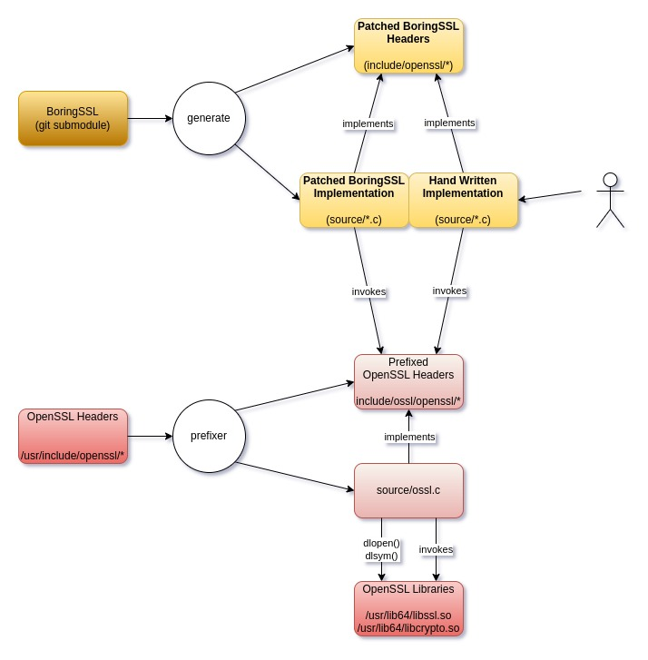

# Summary

Compatibility layer for BoringSSL to OpenSSL.  

This builds on the work of the original Maistra bssl_wrapper code, providing an inplementation of the BoringSSL API in terms of calls onto OpenSSL.

The overall goal of the `bssl-compat` library is to provide an implementation of the BoringSSL API for Envoy to be built against it while reducing the refactoring needed to use OpenSSL on new releases of Envoy.

The library is intended to be delivered as a dynamic library with a C ABI profile (i.e. no name mangling from c++).  

# Requirements
The following packages has to be installed if not yet available in your environment (host or container).

OpenSSL 3.0, development included:
```
sudo dnf install openssl-devel
```

Install clang and llvm:
```
sudo dnf install clang
```

Install  libclang-dev:
```
sudo dnf install clang-devel
```

Install llvm-devel:
```
sudo dnf install llvm-devel
```

Install perl:
```
sudo dnf install perl
```

# Building
Initialize and update git submodules by giving (from envoy-openssl/bssl-compat):

```
git submodule init
git submodule update
```
Build library and tests with:

```sh
mkdir build
cd build
cmake ..
cmake --build .
```

Then, if the OpenSSL libraries are not found in the host, you will have to adjust your LD_LIBRARY_PATH so that libcrypto.so & libssl.so are loaded from the 3.0.7 version of OpenSSL that was built:
```
export LD_LIBRARY_PATH=/usr/lib64/
```

If you want to force the re-build:
```
make clean && make
```
# Testing
The test can be performed:
```
# configure openssl 
cd build
export OPENSSL_CONF=../source/test/openssl.cnf
ctest
```
It is important to set the `OPENSSL_CONF` environment variable as OpenSSL's defaults are more secure than BoringSSL by default, which causes some of the BoringSSL unit tests to fail. That config file activates the legacy provider and drops the seclevel to 1.

Specific tests can be run as:
```bash
cd build
export OPENSSL_CONF=../source/test/openssl.cnf
ctest -R test_EC_KEY_set_public_key_affine_coordinates
```
Tests can also be run as:
```bash
cd build
export OPENSSL_CONF=../source/test/openssl.cnf
./utests-bssl-compat --gtest_filter=SSLTest.test_SSL_SESSION_from_bytes
Running main() from /home/dev/envoy-openssl/bssl-compat/build/_deps/googletest-src/googletest/src/gtest_main.cc
Note: Google Test filter = SSLTest.test_SSL_SESSION_from_bytes
[==========] Running 1 test from 1 test suite.
[----------] Global test environment set-up.
[----------] 1 test from SSLTest
[ RUN      ] SSLTest.test_SSL_SESSION_from_bytes
[       OK ] SSLTest.test_SSL_SESSION_from_bytes (41 ms)
[----------] 1 test from SSLTest (41 ms total)

[----------] Global test environment tear-down
[==========] 1 test from 1 test suite ran. (42 ms total)
[  PASSED  ] 1 test.
```

### BoringSSL Testing

Mapping functions can be tested with BoringSSL tests by adding the required BoringSSL test source file to 
[`utests-bssl-source-list`](https://github.com/envoyproxy/envoy-openssl/blob/e4520c2015ece283bbcb3adc25256ed9cdb34acc/bssl-compat/CMakeLists.txt#L569) and then [create/modify](https://github.com/envoyproxy/envoy-openssl/blob/main/bssl-compat/patch/source/crypto/digest_extra/digest_test.cc.sh) a patch script.

To launch LLVM lint tool clang-tidy, go to the build directory and launch:
```
.../bssl-compat/tools/do-clang-tidy.sh
```
At the end of build, compilation data base will be available in the file:
```
compile_commands.json
```
This make possible to run clang-tidy on a single files:
```
clang-tidy -p build/ <glob or files>
```

After clang-tidy has finished, before starting a build without clang-tidy, remove build directory and start from scratch for "normal" compilation.

To build and run with Address Sanitiser, go to the build directory and launch:
```
.../bssl-compat/tools/do-asan.sh 
ctest
```
Then, if errors are present, output will be available in the file:
```
envoy-openssl/bssl-compat/build/Testing/Temporary/LastTest.log
```

To build and run with Memory Sanitiser, go to the build directory and launch:
```
.../bssl-compat/tools/do-msan.sh 
```

To build and run with Thread Sanitiser, go to the build directory and launch:
```
.../bssl-compat/tools/do-tsan.sh 
ctest
```
Then, if errors are present, output will be available in the file:
```
envoy-openssl/bssl-compat/build/Testing/Temporary/LastTest.log
```


# Structure

The overall goal of the `bssl-compat` library is to provide an implementation of the BoringSSL API, sufficient enough that upstream Envoy can be built against it. To provide that implementation, the `bssl-compat` library makes use of OpenSSL. Given this, it's clear that most code in the library will have to include headers from BoringSSL, to provide the API, and from OpenSSL, to provided the implementation. However, since the two sets of headers look extremely similar, they clash horribly when included in the same compilation unit. This leads to the `prefixer` tool, which gets built and run quite early in the build.

The `prefixer` tool copies the stock OpenSSL headers into `bssl-compat/include/ossl/openssl/*.h` and then adds the `ossl_` prefix to the name of every type, function, macro, effectively scoping the whole API. Prefixing the OpenSSL headers like this, enables us to write mapping code that includes headers from both BoringSSL and OpenSSL in the same compilation unit.  The files in the `include/openssl` folder are the mapped BoringSSL header files.

Since all of the OpenSSL identifiers are prefixed, the two sets of headers can coexist without clashing. However, such code will not link because it uses the prefixed symbols when making OpenSSL calls. To satisfy the prefixed symbols, the `prefixer` tool also generates the implementations of the prefixed functions into `bssl-compat/source/ossl.c`.  Do not edit the generated files `ossl.c` or `ossl.h`.  If `.h` files are edited, they will not be overwritten automatically, requiring them to be deleted to be regenerated.

These generated functions simply make a forward call onto the real (non-prefixed) OpenSSL function, via a function pointer, which is set up by the generated `ossl_init()` library constructor function. This function is marked with the `__attribute__ ((constructor))` attribute, which ensures that it is called early, when the `bssl-compat` library is loaded. It uses `dlopen()` to load OpenSSL's `libcrypto.so` and `libssl.so`, and then uses `dlsym()` to lookup the address of each function and store it's address into the appropriate member of the generated `ossl_functions` struct.

The functions that appear in the `ossl` mapping `struct` in `ossl.h` are a reference for mapping into the OpenSSL libraries.  This mapping does not itself provide API functionality.  The explicit mapping functions are found in the `source` folder and these tie the BoringSSL functions to their OpenSSL functional equivalent.  These can be a simple 1-1 mappings, argument adjustments and can include OpenSSL API calls to provide BoringSSL functional equivalence where simple 1-1 function mappings do not exist.



# Directories

| Name | Notes |
|------|-------|  
| include/openssl | This contains modified Boring SSL include files |
| include/ossl | This contains commented OpenSSL include files |

# Mapping

Mapping BoringSSL functionality to OpenSSL depends on:

    1. OpenSSL structure opacity and the need to use `EVP` functions.
    2. Data structure compatibility and functional isomorphism between API code bases.

## OpenSSL Opaque Data Structures
OpenSSL has some opaque data structures (e.g. `rsa_st`) with members that can not be accessed (this was changed in the OpenSSL code after 1.0).  

Some of these changes have not been matched with the BoringSSL code.

This implies BoringSSL related code can access structure members directly but OpenSSL code requires the use of `EVP` functions.

In these cases there is no alternative but to write a patch file to modify dependent library code as this library **does not** include code from the OpenSSL API.

Consider this example from `jwt_verify_lib`:

BoringSSL:
```c++
  bssl::UniquePtr<RSA> createRsaFromJwk(const std::string& n,
                                        const std::string& e) {
    bssl::UniquePtr<RSA> rsa(RSA_new());
    rsa->n = createBigNumFromBase64UrlString(n).release();
    rsa->e = createBigNumFromBase64UrlString(e).release();
    if (rsa->n == nullptr || rsa->e == nullptr) {
      // RSA public key field is missing or has parse error.
      updateStatus(Status::JwksRsaParseError);
      return nullptr;
    }
    if (BN_cmp_word(rsa->e, 3) != 0 && BN_cmp_word(rsa->e, 65537) != 0) {
      // non-standard key; reject it early.
      updateStatus(Status::JwksRsaParseError);
      return nullptr;
    }
    return rsa;
  }
```
OpenSSL 1.1+
```c++
  bssl::UniquePtr<RSA> createRsaFromJwk(const std::string& n,
                                        const std::string& e) {
    bssl::UniquePtr<RSA> rsa(RSA_new());
    bssl::UniquePtr<BIGNUM> bn_n = createBigNumFromBase64UrlString(n);
    bssl::UniquePtr<BIGNUM> bn_e = createBigNumFromBase64UrlString(e);

    if (bn_n == nullptr || bn_e == nullptr) {
      // RSA public key field is missing or has parse error.
      updateStatus(Status::JwksRsaParseError);
      return nullptr;
    }

    if (BN_cmp_word(bn_e.get(), 3) != 0 && BN_cmp_word(bn_e.get(), 65537) != 0) {
      // non-standard key; reject it early.
      updateStatus(Status::JwksRsaParseError);
      return nullptr;
    }

    RSA_set0_key(rsa.get(), bn_n.release(), bn_e.release(), NULL);
    return rsa;
  }
```
In this case a patch file is needed to replace the code that accesses opaque data structures as a mapping function can not access the `static` data objects in the OpenSSL code.

## Structure Compatibility and Functional Isomorphism

### Requiring Mapping Functions

A mapping function will be required if:

- Data structures used between BoringSSL and OpenSSL are not byte order compatible
- The is no identical matching function between code bases.
- The functions may match with arity and types but functionality is different.
- Special casting (e.g. `const_cast`, or `static_cast`) is needed to pass pointers to structures.
- Return types or values (e.g. 0 vs 1) differ.

In these cases a mapped function acts as an adapter from BoringSSL to OpenSSL.

In this case the source code file name is included in `CMakeLists.txt` `add_library(bssl-compat STATIC`.

### No Mapping Function 

In the cases where there is a direct match and the function arity/types agree a mapping function is not required. 

The required API function name is included in the `CMakeLists.txt` `target_add_bssl_function` with no other action required. 

This will ensure that the BoringSSL function is automatically mapped to the OpenSSL equivalent.

The automatically generated code is in the `build` folder.

### Structure Definitions and `typedefs`

#### Opaque Types

Structure declaration/definition locations vary between BoringSSL and OpenSSL this can lead to "symbol not found" compilation errors:

BoringSSL defines the `ecdsa_sig_st` `struct` in `include/openssl/ecdsa.h`
```C
struct ecdsa_sig_st {
  BIGNUM *r;
  BIGNUM *s;
};
```
whereas in the OpenSSL source, the definition appears in `include/crypto/ec/ec_local.h` (`include/ossl` in the `bssl-compat` source tree.)

```c
struct ECDSA_SIG_st {
BIGNUM *r;                                                
BIGNUM *s;
};
```

In this case the Prefixer will include the following in the converted `base.h`

```C
ossl_ecdsa_sig_st {
    ...
}; 
```
and as `ECDSA_SIG_st` definition is not available (it's in a `crypto` include file) a compile error is generated.

To work around this problem, the patch shell script `base.h.sh` has the inclusion:

```bash
--uncomment-typedef-redef ECDSA_SIG --sed 's/ossl_ecdsa_sig_st/ossl_ECDSA_SIG_st/' \
```
which instructs the Prefixer to:
- make ECDSA_SIG typedef available and
- maps it directly to the OpenSSL type `ECDSA_SIG_st` bypassing any extra aliasing.

#### Non opaque, fully qualified types

The `SHA256_CTX` structure is defined in the OpenSSL source `openssl/sha.h` as 

```c
typedef struct SHA256state_st {
    ossl_SHA_LONG h[8];
    ossl_SHA_LONG Nl, Nh;
    ossl_SHA_LONG data[ossl_SHA_LBLOCK];
    unsigned int num, md_len;
} SHA256_CTX;
```

The BoringSSL source has the same structure byte layout also in `openssl/sha.h'`

```c
struct sha256_state_st {
  uint32_t h[8];
  uint32_t Nl, Nh;
  uint8_t data[SHA256_CBLOCK];
  unsigned num, md_len;
};
```

Client applications using the API, in most cases, use pointers to structs and the content of the struct is opaque and accessed via getters/setters.

However code as in the following case:

```c
  uint8_t sha256[SHA256_DIGEST_LENGTH];
  SHA256_CTX sha_ctx;
  SHA256_Init(&sha_ctx);
  for (auto part : parts) {
    SHA256_Update(&sha_ctx, part.data(), part.size());
  }
  SHA256_Final(sha256, &sha_ctx);
  return std::vector<uint8_t>(std::begin(sha256), std::end(sha256));
}
```
uses a local instance of a `SHA256_CTX`, the compiler in this case _must_ know what the structure layout is.  To achieve 
this, an edit is made to the patch script `base.h.sh` to adjust the definition of `SHA256_CTX` to use the OpenSSL definition 
directly.

```bash
  --uncomment-typedef-redef SHA256_CTX --sed 's/struct ossl_sha256_state_st/struct ossl_SHA256state_st/' \
```
Additionally `#include <ossl/openssl/sha.h>` is added to the `extraincs` definition at the top of the script to ensure 
that the OpenSSL `sha.h` file is included.

With these two changes, the Prefixer then emits a file `base.h` with the following line:

```c
typedef struct ossl_SHA256state_st SHA256_CTX;
```

then any reference to `SHA256_CTX` is using the OpenSSL definition directly.

## Macro Redefinition

Presented with a set of value definitions that may vary between API's:

```c++
#define SSL_CB_LOOP 0x01
#define SSL_CB_HANDSHAKE_START 0x10
#define SSL_CB_HANDSHAKE_DONE 0x20
```

Specifying the following in the patch script `ssl.h.sh`

```sh
  --uncomment-macro-redef SSL_CB_LOOP \
  --uncomment-macro-redef SSL_CB_HANDSHAKE_START \
  --uncomment-macro-redef SSL_CB_HANDSHAKE_DONE \
```

Produces the following mapping in the BoringSSL header `include/openssl/ssl.h`:

```c
#ifdef ossl_SSL_CB_LOOP
#define SSL_CB_LOOP ossl_SSL_CB_LOOP
#endif
#ifdef ossl_SSL_CB_HANDSHAKE_START
#define SSL_CB_HANDSHAKE_START ossl_SSL_CB_HANDSHAKE_START
#endif
#ifdef ossl_SSL_CB_HANDSHAKE_DONE
#define SSL_CB_HANDSHAKE_DONE ossl_SSL_CB_HANDSHAKE_DONE
#endif
```

## Checking Function Inclusion

Confirmation that a mapped function has actually been added can be achieved with the following commands that list exported functions of the library:

```bash
 nm -alg build/libbssl-compat.a | grep -v ossl
```
Checking as specific mapped function has been added:

```bash
nm -alg ./libbssl-compat.a | grep EVP_MD_CTX_create
nm: DWARF error: invalid or unhandled FORM value: 0x23
EVP_MD_CTX_create.cc.o:
0000000000000000 T EVP_MD_CTX_create    /home/dev/envoy-openssl/bssl-compat/source/EVP_MD_CTX_create.cc:9
                 U ossl /home/dev/envoy-openssl/bssl-compat/source/EVP_MD_CTX_create.cc:10
```
or
```bash
objdump --syms ./libbssl-compat.a | grep EVP_MD_CTX_create
EVP_MD_CTX_create.cc.o:     file format elf64-x86-64
0000000000000000 l    df *ABS*  0000000000000000 EVP_MD_CTX_create.cc
0000000000000000 g     F .text  0000000000000013 EVP_MD_CTX_create
```
#  OpenSSL API

Summary of API for 3.0 is on the OpenSSL [man page](https://www.openssl.org/docs/man3.0/man3/).

# Differences OpenSSL and BoringSSL

https://github.com/google/boringssl/blob/master/PORTING.md

