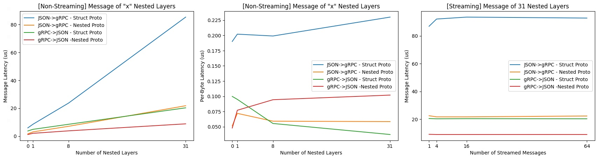
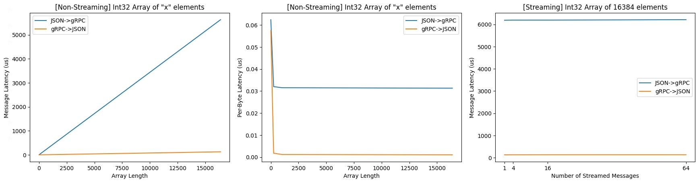
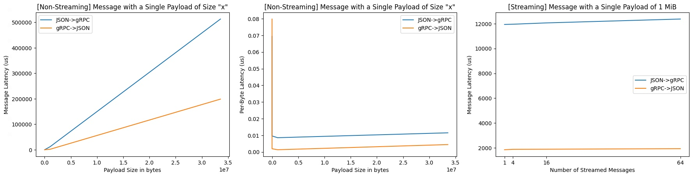
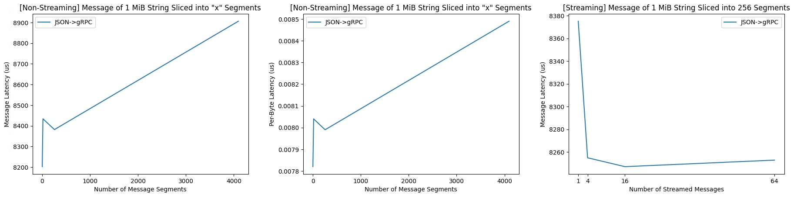
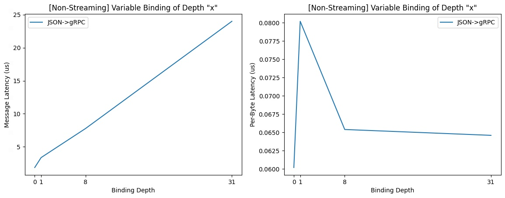
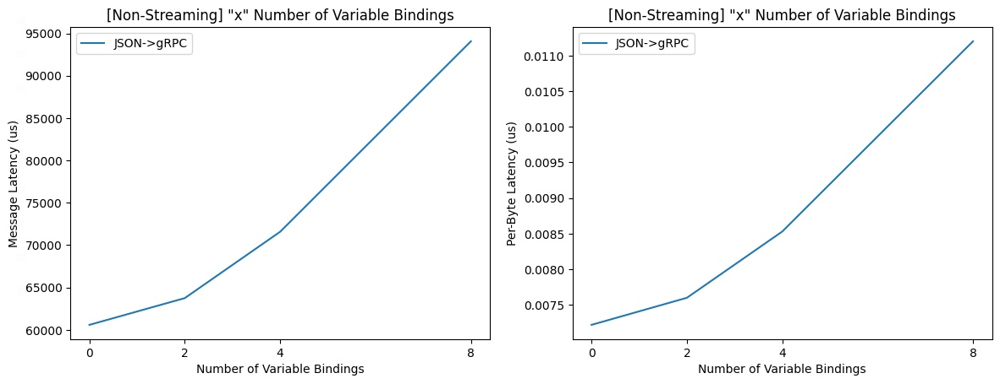

# Performance Benchmark

We use [Google Benchmark](https://github.com/google/benchmark) library to build
our performance benchmark. Variable being tested

- Number of nested JSON layer
- Array length
- Value data type
- Body length
- Number of message segments (JSON -> gRPC only)
- Variable binding depth (JSON -> gRPC only)
- Number of variable bindings (JSON -> gRPC only)

## How to run

```bash
bazel run //perf_benchmark:benchmark_main --compilation_mode=opt -- \
  --benchmark_min_warmup_time=3 \
  --benchmark_repetitions=1000 \
  --benchmark_format=console \
  --benchmark_counters_tabular=true \
  --benchmark_filter=BM_*
```

Options meaning:

- `--compilation_mode=opt`: Bazel option to build the library in release mode.
  Without this, the library runs in debug mode.
- `benchmark_min_warmup_time=<int>`: the amount of time for which the warmup
  should be run
- `benchmark_repetitions=<int>`: the test will automatically run several
  iterations, but only one data point is captured per run. Setting repetition to
  1000 gives us 1000 data points, which would make percentiles and standard
  deviation more meaningful.
- `benchmark_format=<console|json|csv>`: where to output benchmark results.
- `benchmark_counters_tabular=<true|false>`: it's useful when outputting to
  console.
- `benchmark_filter=<regex>`: it can be used to only run the benchmarks that
  match the specified <regex>.

## Captured data

- Elapsed time and CPU time
- Byte latency and throughput
- Message latency and throughput
    - _Note: message latency should equal to CPU time_
- Request latency and throughput
    - `Request Latency` = `Message Latency` * `Number of Streamed Messages`.
      _Note: Request latency equals to message latency in non-streaming
      benchmarks._

We also capture p25, p50, p75, p90, p99, and p999 for each test,
but `--benchmark_repetitions=1000` is recommended for the results to be
meaningful.

## Run in docker

We use [rules_docker](https://github.com/bazelbuild/rules_docker) to package the
benchmark binary into a docker image. To build it

```bash
# change `bazel build` to `bazel run` to start the container directly
bazel build //perf_benchmark:benchmark_main_image --compilation_mode=opt
```

There is also a `benchmark_main_image_push` rule to push the image to a docker
registry.

```bash
bazel run //perf_benchmark:benchmark_main_image_push \
 --define=PUSH_REGISTRY=gcr.io \
 --define=PUSH_PROJECT=project-id \
 --define=PUSH_TAG=latest
```

## Benchmark Results

### Environment Setup

We ran the benchmark on the `n1-highmem-32` machines offered from Google Cloud
Kubernetes Engine (GKE). The container is running in Debian 12.

The request memory and cpu are `512Mi` and `500m` respectively, and the limit
memory and cpu are `2Gi` and `2` respectively. The transcoder and benchmark
binaries run in a single-thread, so vCPU with 2 cores is sufficient.

The benchmark was started using the following arguments

```
--benchmark_repetitions=1100 \
--benchmark_counters_tabular=true \
--benchmark_min_warmup_time=3 \
--benchmark_format=csv
```

Below, we present the visualization using the median values among the 1100
repetitions.

### Number of Nested Layers

There are two ways to represent nested JSON structure - using a recursively
defined protobuf message (`NestedPayload` in `benchmark.proto`) or
using `google/protobuf/struct.proto`. We benchmarked the effects of having 0, 1,
8, and 31 nested layers of a string payload "Deep Hello World!".

- The performance of `google/protobuf/struct.proto` is worse than a recursively
  defined protobuf message in both JSON -> gRPC and gRPC -> JSON cases.
- Transcoding for gRPC -> JSON has a much better performance.
- Transcoding streamed messages doesn't add extra overhead.
- The per-byte latency of nested structure does not conform to a trend.



### Array Length

We benchmarked the effects of having just an int32 array of 1, 256, 1024, and
16384 random integers.

- Transcoding for JSON -> gRPC has much worse performance than transcoding for
  gRPC -> JSON.
- The per-byte latency for non-streaming message converges when the array length
  is over 1024 - 0.03 us for JSON -> gRPC and 0.001 for gRPC -> JSON.
- Streaming messages has almost little overhead.



### Body Length

We benchmarked the effects of a message containing a single `bytes` typed field
with data length of 1 byte, 1 KiB, 1 MiB, and 32 MiB.

_Note: The JSON representation of `bytes` typed protobuf field is encoded in
base64. Therefore, 1 MiB sized message in gRPC would have roughly 1.33 MiB in
JSON. The per-byte latency is calculated using the unencoded data size, which is
why the per-byte latency would give around 34000 for 32 MiB of data, whereas the
message latency for 32 MiB is actually around 50000._

- Transcoding for JSON -> gRPC has worse performance than transcoding for gRPC
  -> JSON.
- The per-byte latency for non-streaming message converges to 0.01 us for JSON
  -> gRPC and 0.005 us for gRPC -> JSON.
- Streaming messages has almost little overhead.



### Number of Message Segments

We benchmarked the effects for a 1 MiB string message to arrive in 1, 16, 256,
and 4096 segments. This only applies to JSON -> gRPC since gRPC doesn't support
incomplete messages. Currently, the caller needs to make sure the message
arrives in full before transcoding from gRPC.

- There is a noticeable increase when the number of message segment increase to
  more than 1.
- The overhead scales up linearly as the number of message segments increases.
- The effect of having segmented message becomes less when the message is
  streamed.



### Value Data Type

We benchmarked transcoding from an array of 1024 zeros `[0, 0, ..., 0]`
into `string`, `double`, and `int32` type.

- `string` data type has the less overhead.
- `double` has the most significant overhead for transcoding.

The performance difference is caused from
the [protocol buffer wire types](https://developers.google.com/protocol-buffers/docs/encoding#structure)
. `double` uses `64-bit` wire encoding, `string` uses `Length-delimited`
encoding, and `int32` uses `Varint` encoding. In `64-bit` encoding, number 0 is
encoded into 8 bytes, whereas in `Varint` and `Length-delimited` encoding would
make it are shorter than 8 bytes.

Also note the following encoded message length - benchmark uses `proto3` syntax
which by default
uses [packed repeated fields](https://developers.google.com/protocol-buffers/docs/encoding#packed)
to encode arrays. However, transcoding library does not use this by default.
This caused the difference between JSON -> gRPC and gRPC -> JSON binary length
for int32 and double types.

```
JSON -> gRPC: Int32ArrayPayload  proto binary length: 2048
gRPC -> JSON: Int32ArrayPayload  proto binary length: 1027

JSON -> gRPC: DoubleArrayPayload  proto binary length: 9216
gRPC -> JSON: DoubleArrayPayload  proto binary length: 8195

JSON -> gRPC: StringArrayPayload  proto binary length: 3072
gRPC -> JSON: StringArrayPayload  proto binary length: 3072
```


### Variable Binding Depth

We benchmarked the effects of having 0, 1, 8, and 32 nested variable bindings in
JSON -> gRPC. We used the same `NestedPayload` setup as in
the [number of nested layers variable](#number-of-nested-layers) except that the
field value comes from the variable binding instead of the JSON input. There is
no variable binding from gRPC -> JSON. Streaming benchmark doesn't apply here
because the same insights can be collected from the JSON body length benchmarks.

- The overhead of a deeper variable binding scales linearly.
- Having nested variable bindings can introduce a noticeable overhead, but the
  per-byte latency drops as the number of nested layers grows.



### Number of Variable Bindings

Similarly, we benchmarked the effects of having 0, 2, 4, and 8 variable bindings
in JSON -> gRPC. We used `MultiStringFieldPayload` in `benchmark.proto` which
has 8 string fields. We made sure the input to the benchmark is the same for all
the test cases - a JSON object having 8 random string of 1 MiB size. When the
number of variable bindings is `x`, `8-x` field will be set from the JSON input,
and `x` fields will be set from the variable bindings.

- The overhead of a deeper variable binding scales linearly.


