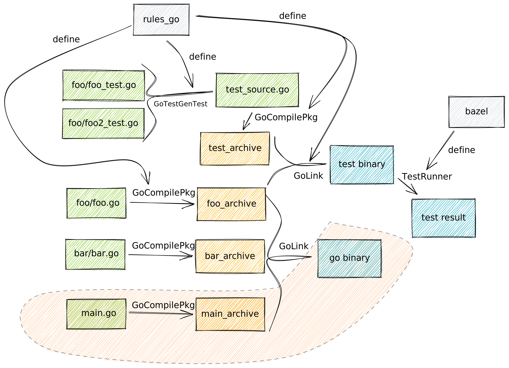

<!-- Generated with Stardoc: http://skydoc.bazel.build -->


  ["Make variable"]: https://docs.bazel.build/versions/master/be/make-variables.html
  [Bourne shell tokenization]: https://docs.bazel.build/versions/master/be/common-definitions.html#sh-tokenization
  [Gazelle]: https://github.com/bazelbuild/bazel-gazelle
  [GoArchive]: /go/providers.rst#GoArchive
  [GoPath]: /go/providers.rst#GoPath
  [GoInfo]: /go/providers.rst#GoInfo
  [build constraints]: https://golang.org/pkg/go/build/#hdr-Build_Constraints
  [cc_library deps]: https://docs.bazel.build/versions/master/be/c-cpp.html#cc_library.deps
  [cgo]: http://golang.org/cmd/cgo/
  [config_setting]: https://docs.bazel.build/versions/master/be/general.html#config_setting
  [data dependencies]: https://bazel.build/concepts/dependencies#data-dependencies
  [goarch]: /go/modes.rst#goarch
  [goos]: /go/modes.rst#goos
  [mode attributes]: /go/modes.rst#mode-attributes
  [nogo]: /go/nogo.rst#nogo
  [pure]: /go/modes.rst#pure
  [race]: /go/modes.rst#race
  [msan]: /go/modes.rst#msan
  [select]: https://docs.bazel.build/versions/master/be/functions.html#select
  [shard_count]: https://docs.bazel.build/versions/master/be/common-definitions.html#test.shard_count
  [static]: /go/modes.rst#static
  [test_arg]: https://docs.bazel.build/versions/master/user-manual.html#flag--test_arg
  [test_filter]: https://docs.bazel.build/versions/master/user-manual.html#flag--test_filter
  [test_env]: https://docs.bazel.build/versions/master/user-manual.html#flag--test_env
  [test_runner_fail_fast]: https://docs.bazel.build/versions/master/command-line-reference.html#flag--test_runner_fail_fast
  [define and register a C/C++ toolchain and platforms]: https://bazel.build/extending/toolchains#toolchain-definitions
  [bazel]: https://pkg.go.dev/github.com/bazelbuild/rules_go/go/tools/bazel?tab=doc
  [go_library]: #go_library
  [go_binary]: #go_binary
  [go_test]: #go_test
  [go_path]: #go_path
  [go_source]: #go_source
  [go_test]: #go_test
  [go_reset_target]: #go_reset_target
  [Examples]: examples.md#examples
  [Defines and stamping]: defines_and_stamping.md#defines-and-stamping
  [Stamping with the workspace status script]: defines_and_stamping.md#stamping-with-the-workspace-status-script
  [Embedding]: embedding.md#embedding
  [Cross compilation]: cross_compilation.md#cross-compilation
  [Platform-specific dependencies]: platform-specific_dependencies.md#platform-specific-dependencies

# Core Go rules

These are the core go rules, required for basic operation. The intent is that these rules are
sufficient to match the capabilities of the normal go tools.

## Additional resources
- ["Make variable"]
- [Bourne shell tokenization]
- [Gazelle]
- [GoArchive]
- [GoPath]
- [GoInfo]
- [build constraints]:
- [cc_library deps]
- [cgo]
- [config_setting]
- [data dependencies]
- [goarch]
- [goos]
- [mode attributes]
- [nogo]
- [pure]
- [race]
- [msan]
- [select]:
- [shard_count]
- [static]
- [test_arg]
- [test_filter]
- [test_env]
- [test_runner_fail_fast]
- [define and register a C/C++ toolchain and platforms]
- [bazel]


------------------------------------------------------------------------

Introduction
------------

Three core rules may be used to build most projects: [go_library], [go_binary],
and [go_test]. These rules reimplement the low level plumping commands of a normal
'go build' invocation: compiling package's source files to archives, then linking
archives into go binary.

[go_library] builds a single package. It has a list of source files
(specified with `srcs`) and may depend on other packages (with `deps`).
Each [go_library] has an `importpath`, which is the name used to import it
in Go source files.

[go_binary] also builds a single `main` package and links it into an
executable. It may embed the content of a [go_library] using the `embed`
attribute. Embedded sources are compiled together in the same package.
Binaries can be built for alternative platforms and configurations by setting
`goos`, `goarch`, and other attributes.

[go_test] builds a test executable. Like tests produced by `go test`, this
consists of three packages: an internal test package compiled together with
the library being tested (specified with `embed`), an external test package
compiled separately, and a generated test main package.

Here is an example of a Bazel build graph for a project using these core rules:



By instrumenting the lower level go tooling, we can cache smaller, finer
artifacts with Bazel and thus, speed up incremental builds.

Rules
-----


<a id="#go_binary"></a>

## go_binary

<pre>
go_binary(<a href="#go_binary-name">name</a>, <a href="#go_binary-basename">basename</a>, <a href="#go_binary-cdeps">cdeps</a>, <a href="#go_binary-cgo">cgo</a>, <a href="#go_binary-clinkopts">clinkopts</a>, <a href="#go_binary-copts">copts</a>, <a href="#go_binary-cppopts">cppopts</a>, <a href="#go_binary-cxxopts">cxxopts</a>, <a href="#go_binary-data">data</a>, <a href="#go_binary-deps">deps</a>, <a href="#go_binary-embed">embed</a>,
          <a href="#go_binary-embedsrcs">embedsrcs</a>, <a href="#go_binary-env">env</a>, <a href="#go_binary-gc_goopts">gc_goopts</a>, <a href="#go_binary-gc_linkopts">gc_linkopts</a>, <a href="#go_binary-goarch">goarch</a>, <a href="#go_binary-goos">goos</a>, <a href="#go_binary-gotags">gotags</a>, <a href="#go_binary-importpath">importpath</a>, <a href="#go_binary-linkmode">linkmode</a>, <a href="#go_binary-msan">msan</a>,
          <a href="#go_binary-out">out</a>, <a href="#go_binary-pgoprofile">pgoprofile</a>, <a href="#go_binary-pure">pure</a>, <a href="#go_binary-race">race</a>, <a href="#go_binary-srcs">srcs</a>, <a href="#go_binary-static">static</a>, <a href="#go_binary-x_defs">x_defs</a>)
</pre>

This builds an executable from a set of source files,
        which must all be in the `main` package. You can run the binary with
        `bazel run`, or you can build it with `bazel build` and run it directly.<br><br>
        ***Note:*** `name` should be the same as the desired name of the generated binary.<br><br>
        **Providers:**
        <ul>
          <li>[GoArchive]</li>
        </ul>
        

### **Attributes**


| Name  | Description | Type | Mandatory | Default |
| :------------- | :------------- | :------------- | :------------- | :------------- |
| <a id="go_binary-name"></a>name |  A unique name for this target.   | <a href="https://bazel.build/concepts/labels#target-names">Name</a> | required |  |
| <a id="go_binary-basename"></a>basename |  The basename of this binary. The binary                 basename may also be platform-dependent: on Windows, we add an .exe extension.   | String | optional | "" |
| <a id="go_binary-cdeps"></a>cdeps |  The list of other libraries that the c code depends on.                 This can be anything that would be allowed in [cc_library deps]                 Only valid if <code>cgo</code> = <code>True</code>.   | <a href="https://bazel.build/concepts/labels">List of labels</a> | optional | [] |
| <a id="go_binary-cgo"></a>cgo |  If <code>True</code>, the package may contain [cgo] code, and <code>srcs</code> may contain                 C, C++, Objective-C, and Objective-C++ files and non-Go assembly files.                 When cgo is enabled, these files will be compiled with the C/C++ toolchain                 and included in the package. Note that this attribute does not force cgo                 to be enabled. Cgo is enabled for non-cross-compiling builds when a C/C++                 toolchain is configured.   | Boolean | optional | False |
| <a id="go_binary-clinkopts"></a>clinkopts |  List of flags to add to the C link command.                 Subject to ["Make variable"] substitution and [Bourne shell tokenization].                 Only valid if <code>cgo</code> = <code>True</code>.   | List of strings | optional | [] |
| <a id="go_binary-copts"></a>copts |  List of flags to add to the C compilation command.                 Subject to ["Make variable"] substitution and [Bourne shell tokenization].                 Only valid if <code>cgo</code> = <code>True</code>.   | List of strings | optional | [] |
| <a id="go_binary-cppopts"></a>cppopts |  List of flags to add to the C/C++ preprocessor command.                 Subject to ["Make variable"] substitution and [Bourne shell tokenization].                 Only valid if <code>cgo</code> = <code>True</code>.   | List of strings | optional | [] |
| <a id="go_binary-cxxopts"></a>cxxopts |  List of flags to add to the C++ compilation command.                 Subject to ["Make variable"] substitution and [Bourne shell tokenization].                 Only valid if <code>cgo</code> = <code>True</code>.   | List of strings | optional | [] |
| <a id="go_binary-data"></a>data |  List of files needed by this rule at run-time. This may include data files                 needed or other programs that may be executed. The [bazel] package may be                 used to locate run files; they may appear in different places depending on the                 operating system and environment. See [data dependencies] for more                 information on data files.   | <a href="https://bazel.build/concepts/labels">List of labels</a> | optional | [] |
| <a id="go_binary-deps"></a>deps |  List of Go libraries this package imports directly.                 These may be <code>go_library</code> rules or compatible rules with the [GoInfo] provider.   | <a href="https://bazel.build/concepts/labels">List of labels</a> | optional | [] |
| <a id="go_binary-embed"></a>embed |  List of Go libraries whose sources should be compiled together with this                 binary's sources. Labels listed here must name <code>go_library</code>,                 <code>go_proto_library</code>, or other compatible targets with the [GoInfo] provider.                 Embedded libraries must all have the same <code>importpath</code>,                 which must match the <code>importpath</code> for this <code>go_binary</code> if one is                 specified. At most one embedded library may have <code>cgo = True</code>, and the                 embedding binary may not also have <code>cgo = True</code>. See [Embedding] for                 more information.   | <a href="https://bazel.build/concepts/labels">List of labels</a> | optional | [] |
| <a id="go_binary-embedsrcs"></a>embedsrcs |  The list of files that may be embedded into the compiled package using                 <code>//go:embed</code> directives. All files must be in the same logical directory                 or a subdirectory as source files. All source files containing <code>//go:embed</code>                 directives must be in the same logical directory. It's okay to mix static and                 generated source files and static and generated embeddable files.   | <a href="https://bazel.build/concepts/labels">List of labels</a> | optional | [] |
| <a id="go_binary-env"></a>env |  Environment variables to set when the binary is executed with bazel run.                 The values (but not keys) are subject to                 [location expansion](https://docs.bazel.build/versions/main/skylark/macros.html) but not full                 [make variable expansion](https://docs.bazel.build/versions/main/be/make-variables.html).   | <a href="https://bazel.build/rules/lib/dict">Dictionary: String -> String</a> | optional | {} |
| <a id="go_binary-gc_goopts"></a>gc_goopts |  List of flags to add to the Go compilation command when using the gc compiler.                 Subject to ["Make variable"] substitution and [Bourne shell tokenization].   | List of strings | optional | [] |
| <a id="go_binary-gc_linkopts"></a>gc_linkopts |  List of flags to add to the Go link command when using the gc compiler.                 Subject to ["Make variable"] substitution and [Bourne shell tokenization].   | List of strings | optional | [] |
| <a id="go_binary-goarch"></a>goarch |  Forces a binary to be cross-compiled for a specific architecture. It's usually                 better to control this on the command line with <code>--platforms</code>.<br><br>                This disables cgo by default, since a cross-compiling C/C++ toolchain is                 rarely available. To force cgo, set <code>pure</code> = <code>off</code>.<br><br>                See [Cross compilation] for more information.   | String | optional | "auto" |
| <a id="go_binary-goos"></a>goos |  Forces a binary to be cross-compiled for a specific operating system. It's                 usually better to control this on the command line with <code>--platforms</code>.<br><br>                This disables cgo by default, since a cross-compiling C/C++ toolchain is                 rarely available. To force cgo, set <code>pure</code> = <code>off</code>.<br><br>                See [Cross compilation] for more information.   | String | optional | "auto" |
| <a id="go_binary-gotags"></a>gotags |  Enables a list of build tags when evaluating [build constraints]. Useful for                 conditional compilation.   | List of strings | optional | [] |
| <a id="go_binary-importpath"></a>importpath |  The import path of this binary. Binaries can't actually be imported, but this                 may be used by [go_path] and other tools to report the location of source                 files. This may be inferred from embedded libraries.   | String | optional | "" |
| <a id="go_binary-linkmode"></a>linkmode |  Determines how the binary should be built and linked. This accepts some of                 the same values as `go build -buildmode` and works the same way.                 <br><br>                 <ul>                 <li>`auto` (default): Controlled by `//go/config:linkmode`, which defaults to `normal`.</li>                 <li>`normal`: Builds a normal executable with position-dependent code.</li>                 <li>`pie`: Builds a position-independent executable.</li>                 <li>`plugin`: Builds a shared library that can be loaded as a Go plugin. Only supported on platforms that support plugins.</li>                 <li>`c-shared`: Builds a shared library that can be linked into a C program.</li>                 <li>`c-archive`: Builds an archive that can be linked into a C program.</li>                 </ul>   | String | optional | "auto" |
| <a id="go_binary-msan"></a>msan |  Controls whether code is instrumented for memory sanitization. May be one of                 <code>on</code>, <code>off</code>, or <code>auto</code>. Not available when cgo is                 disabled. In most cases, it's better to control this on the command line with                 <code>--@io_bazel_rules_go//go/config:msan</code>. See [mode attributes], specifically                 [msan].   | String | optional | "auto" |
| <a id="go_binary-out"></a>out |  Sets the output filename for the generated executable. When set, <code>go_binary</code>                 will write this file without mode-specific directory prefixes, without                 linkmode-specific prefixes like "lib", and without platform-specific suffixes                 like ".exe". Note that without a mode-specific directory prefix, the                 output file (but not its dependencies) will be invalidated in Bazel's cache                 when changing configurations.   | String | optional | "" |
| <a id="go_binary-pgoprofile"></a>pgoprofile |  Provides a pprof file to be used for profile guided optimization when compiling go targets.                 A pprof file can also be provided via <code>--@io_bazel_rules_go//go/config:pgoprofile=&lt;label of a pprof file&gt;</code>.                 Profile guided optimization is only supported on go 1.20+.                 See https://go.dev/doc/pgo for more information.   | <a href="https://bazel.build/concepts/labels">Label</a> | optional | //go/config:empty |
| <a id="go_binary-pure"></a>pure |  Controls whether cgo source code and dependencies are compiled and linked,                 similar to setting <code>CGO_ENABLED</code>. May be one of <code>on</code>, <code>off</code>,                 or <code>auto</code>. If <code>auto</code>, pure mode is enabled when no C/C++                 toolchain is configured or when cross-compiling. It's usually better to                 control this on the command line with                 <code>--@io_bazel_rules_go//go/config:pure</code>. See [mode attributes], specifically                 [pure].   | String | optional | "auto" |
| <a id="go_binary-race"></a>race |  Controls whether code is instrumented for race detection. May be one of                 <code>on</code>, <code>off</code>, or <code>auto</code>. Not available when cgo is                 disabled. In most cases, it's better to control this on the command line with                 <code>--@io_bazel_rules_go//go/config:race</code>. See [mode attributes], specifically                 [race].   | String | optional | "auto" |
| <a id="go_binary-srcs"></a>srcs |  The list of Go source files that are compiled to create the package.                 Only <code>.go</code>, <code>.s</code>, and <code>.syso</code> files are permitted, unless the <code>cgo</code>                 attribute is set, in which case,                 <code>.c .cc .cpp .cxx .h .hh .hpp .hxx .inc .m .mm</code>                 files are also permitted. Files may be filtered at build time                 using Go [build constraints].   | <a href="https://bazel.build/concepts/labels">List of labels</a> | optional | [] |
| <a id="go_binary-static"></a>static |  Controls whether a binary is statically linked. May be one of <code>on</code>,                 <code>off</code>, or <code>auto</code>. Not available on all platforms or in all                 modes. It's usually better to control this on the command line with                 <code>--@io_bazel_rules_go//go/config:static</code>. See [mode attributes],                 specifically [static].   | String | optional | "auto" |
| <a id="go_binary-x_defs"></a>x_defs |  Map of defines to add to the go link command.                 See [Defines and stamping] for examples of how to use these.   | <a href="https://bazel.build/rules/lib/dict">Dictionary: String -> String</a> | optional | {} |


<a id="#go_cross_binary"></a>

## go_cross_binary

<pre>
go_cross_binary(<a href="#go_cross_binary-name">name</a>, <a href="#go_cross_binary-platform">platform</a>, <a href="#go_cross_binary-sdk_version">sdk_version</a>, <a href="#go_cross_binary-target">target</a>)
</pre>

This wraps an executable built by `go_binary` to cross compile it
    for a different platform, and/or compile it using a different version
    of the golang SDK.<br><br>
    **Providers:**
    <ul>
      <li>[GoArchive]</li>
    </ul>
    

### **Attributes**


| Name  | Description | Type | Mandatory | Default |
| :------------- | :------------- | :------------- | :------------- | :------------- |
| <a id="go_cross_binary-name"></a>name |  A unique name for this target.   | <a href="https://bazel.build/concepts/labels#target-names">Name</a> | required |  |
| <a id="go_cross_binary-platform"></a>platform |  The platform to cross compile the <code>target</code> for.             If unspecified, the <code>target</code> will be compiled with the             same platform as it would've with the original <code>go_binary</code> rule.   | <a href="https://bazel.build/concepts/labels">Label</a> | optional | None |
| <a id="go_cross_binary-sdk_version"></a>sdk_version |  The golang SDK version to use for compiling the <code>target</code>.             Supports specifying major, minor, and/or patch versions, eg. <code>"1"</code>,             <code>"1.17"</code>, or <code>"1.17.1"</code>. The first Go SDK provider installed in the             repo's workspace (via <code>go_download_sdk</code>, <code>go_wrap_sdk</code>, etc) that             matches the specified version will be used for compiling the given             <code>target</code>. If unspecified, the <code>target</code> will be compiled with the same             SDK as it would've with the original <code>go_binary</code> rule.             Transitions <code>target</code> by changing the <code>--@io_bazel_rules_go//go/toolchain:sdk_version</code>             build flag to the value provided for <code>sdk_version</code> here.   | String | optional | "" |
| <a id="go_cross_binary-target"></a>target |  Go binary target to transition to the given platform and/or sdk_version.   | <a href="https://bazel.build/concepts/labels">Label</a> | required |  |


<a id="#go_library"></a>

## go_library

<pre>
go_library(<a href="#go_library-name">name</a>, <a href="#go_library-cdeps">cdeps</a>, <a href="#go_library-cgo">cgo</a>, <a href="#go_library-clinkopts">clinkopts</a>, <a href="#go_library-copts">copts</a>, <a href="#go_library-cppopts">cppopts</a>, <a href="#go_library-cxxopts">cxxopts</a>, <a href="#go_library-data">data</a>, <a href="#go_library-deps">deps</a>, <a href="#go_library-embed">embed</a>, <a href="#go_library-embedsrcs">embedsrcs</a>,
           <a href="#go_library-gc_goopts">gc_goopts</a>, <a href="#go_library-importmap">importmap</a>, <a href="#go_library-importpath">importpath</a>, <a href="#go_library-importpath_aliases">importpath_aliases</a>, <a href="#go_library-srcs">srcs</a>, <a href="#go_library-x_defs">x_defs</a>)
</pre>

This builds a Go library from a set of source files that are all part of
    the same package.<br><br>
    ***Note:*** For targets generated by Gazelle, `name` is typically the last component of the path,
    or `go_default_library`, with the old naming convention.<br><br>
    **Providers:**
    <ul>
      <li>[GoInfo]</li>
      <li>[GoArchive]</li>
    </ul>
    

### **Attributes**


| Name  | Description | Type | Mandatory | Default |
| :------------- | :------------- | :------------- | :------------- | :------------- |
| <a id="go_library-name"></a>name |  A unique name for this target.   | <a href="https://bazel.build/concepts/labels#target-names">Name</a> | required |  |
| <a id="go_library-cdeps"></a>cdeps |  List of other libraries that the c code depends on.             This can be anything that would be allowed in [cc_library deps] Only valid if <code>cgo = True</code>.   | <a href="https://bazel.build/concepts/labels">List of labels</a> | optional | [] |
| <a id="go_library-cgo"></a>cgo |  If <code>True</code>, the package may contain [cgo] code, and <code>srcs</code> may contain C, C++, Objective-C, and Objective-C++ files             and non-Go assembly files. When cgo is enabled, these files will be compiled with the C/C++ toolchain and             included in the package. Note that this attribute does not force cgo to be enabled. Cgo is enabled for             non-cross-compiling builds when a C/C++ toolchain is configured.   | Boolean | optional | False |
| <a id="go_library-clinkopts"></a>clinkopts |  List of flags to add to the C link command.             Subject to ["Make variable"] substitution and [Bourne shell tokenization]. Only valid if <code>cgo = True</code>.   | List of strings | optional | [] |
| <a id="go_library-copts"></a>copts |  List of flags to add to the C compilation command.             Subject to ["Make variable"] substitution and [Bourne shell tokenization]. Only valid if <code>cgo = True</code>.   | List of strings | optional | [] |
| <a id="go_library-cppopts"></a>cppopts |  List of flags to add to the C/C++ preprocessor command.             Subject to ["Make variable"] substitution and [Bourne shell tokenization].             Only valid if <code>cgo = True</code>.   | List of strings | optional | [] |
| <a id="go_library-cxxopts"></a>cxxopts |  List of flags to add to the C++ compilation command.             Subject to ["Make variable"] substitution and [Bourne shell tokenization]. Only valid if <code>cgo = True</code>.   | List of strings | optional | [] |
| <a id="go_library-data"></a>data |  List of files needed by this rule at run-time.             This may include data files needed or other programs that may be executed.             The [bazel] package may be used to locate run files; they may appear in different places             depending on the operating system and environment. See [data dependencies] for more information on data files.   | <a href="https://bazel.build/concepts/labels">List of labels</a> | optional | [] |
| <a id="go_library-deps"></a>deps |  List of Go libraries this package imports directly.             These may be <code>go_library</code> rules or compatible rules with the [GoInfo] provider.   | <a href="https://bazel.build/concepts/labels">List of labels</a> | optional | [] |
| <a id="go_library-embed"></a>embed |  List of Go libraries whose sources should be compiled together with this package's sources.             Labels listed here must name <code>go_library</code>, <code>go_proto_library</code>, or other compatible targets with             the [GoInfo] provider. Embedded libraries must have the same <code>importpath</code> as the embedding library.             At most one embedded library may have <code>cgo = True</code>, and the embedding library may not also have <code>cgo = True</code>.             See [Embedding] for more information.   | <a href="https://bazel.build/concepts/labels">List of labels</a> | optional | [] |
| <a id="go_library-embedsrcs"></a>embedsrcs |  The list of files that may be embedded into the compiled package using <code>//go:embed</code>             directives. All files must be in the same logical directory or a subdirectory as source files.             All source files containing <code>//go:embed</code> directives must be in the same logical directory.             It's okay to mix static and generated source files and static and generated embeddable files.   | <a href="https://bazel.build/concepts/labels">List of labels</a> | optional | [] |
| <a id="go_library-gc_goopts"></a>gc_goopts |  List of flags to add to the Go compilation command when using the gc compiler.             Subject to ["Make variable"] substitution and [Bourne shell tokenization].   | List of strings | optional | [] |
| <a id="go_library-importmap"></a>importmap |  The actual import path of this library. By default, this is <code>importpath</code>. This is mostly only visible to the compiler and linker,             but it may also be seen in stack traces. This must be unique among packages passed to the linker.             It may be set to something different than <code>importpath</code> to prevent conflicts between multiple packages             with the same path (for example, from different vendor directories).   | String | optional | "" |
| <a id="go_library-importpath"></a>importpath |  The source import path of this library. Other libraries can import this library using this path.             This must either be specified in <code>go_library</code> or inherited from one of the libraries in <code>embed</code>.   | String | optional | "" |
| <a id="go_library-importpath_aliases"></a>importpath_aliases |  -   | List of strings | optional | [] |
| <a id="go_library-srcs"></a>srcs |  The list of Go source files that are compiled to create the package.             Only <code>.go</code>, <code>.s</code>, and <code>.syso</code> files are permitted, unless the <code>cgo</code> attribute is set,             in which case, <code>.c .cc .cpp .cxx .h .hh .hpp .hxx .inc .m .mm</code> files are also permitted.             Files may be filtered at build time using Go [build constraints].   | <a href="https://bazel.build/concepts/labels">List of labels</a> | optional | [] |
| <a id="go_library-x_defs"></a>x_defs |  Map of defines to add to the go link command. See [Defines and stamping] for examples of how to use these.   | <a href="https://bazel.build/rules/lib/dict">Dictionary: String -> String</a> | optional | {} |


<a id="#go_path"></a>

## go_path

<pre>
go_path(<a href="#go_path-name">name</a>, <a href="#go_path-data">data</a>, <a href="#go_path-deps">deps</a>, <a href="#go_path-include_data">include_data</a>, <a href="#go_path-include_pkg">include_pkg</a>, <a href="#go_path-include_transitive">include_transitive</a>, <a href="#go_path-mode">mode</a>)
</pre>

`go_path` builds a directory structure that can be used with
    tools that understand the GOPATH directory layout. This directory structure
    can be built by zipping, copying, or linking files.
    `go_path` can depend on one or more Go targets (i.e., [go_library], [go_binary], or [go_test]).
    It will include packages from those targets, as well as their transitive dependencies.
    Packages will be in subdirectories named after their `importpath` or `importmap` attributes under a `src/` directory.
    

### **Attributes**


| Name  | Description | Type | Mandatory | Default |
| :------------- | :------------- | :------------- | :------------- | :------------- |
| <a id="go_path-name"></a>name |  A unique name for this target.   | <a href="https://bazel.build/concepts/labels#target-names">Name</a> | required |  |
| <a id="go_path-data"></a>data |  A list of targets producing data files that will be stored next to the             <code>src/</code> directory. Useful for including things like licenses and readmes.   | <a href="https://bazel.build/concepts/labels">List of labels</a> | optional | [] |
| <a id="go_path-deps"></a>deps |  A list of targets that build Go packages. A directory will be generated from             files in these targets and their transitive dependencies. All targets must             provide [GoArchive] ([go_library], [go_binary], [go_test], and similar             rules have this).<br><br>            Only targets with explicit <code>importpath</code> attributes will be included in the             generated directory. Synthetic packages (like the main package produced by             [go_test]) and packages with inferred import paths will not be             included. The values of <code>importmap</code> attributes may influence the placement             of packages within the generated directory (for example, in vendor             directories).<br><br>            The generated directory will contain original source files, including .go,             .s, .h, and .c files compiled by cgo. It will not contain files generated by             tools like cover and cgo, but it will contain generated files passed in             <code>srcs</code> attributes like .pb.go files. The generated directory will also             contain runfiles found in <code>data</code> attributes.   | <a href="https://bazel.build/concepts/labels">List of labels</a> | optional | [] |
| <a id="go_path-include_data"></a>include_data |  When true, data files referenced by libraries, binaries, and tests will be             included in the output directory. Files listed in the <code>data</code> attribute             for this rule will be included regardless of this attribute.   | Boolean | optional | True |
| <a id="go_path-include_pkg"></a>include_pkg |  When true, a <code>pkg</code> subdirectory containing the compiled libraries will be created in the             generated <code>GOPATH</code> containing compiled libraries.   | Boolean | optional | False |
| <a id="go_path-include_transitive"></a>include_transitive |  When true, the transitive dependency graph will be included in the generated <code>GOPATH</code>. This is             the default behaviour. When false, only the direct dependencies will be included in the             generated <code>GOPATH</code>.   | Boolean | optional | True |
| <a id="go_path-mode"></a>mode |  Determines how the generated directory is provided. May be one of:             <ul>                 <li><code>"archive"</code>: The generated directory is packaged as a single .zip file.</li>                 <li><code>"copy"</code>: The generated directory is a single tree artifact. Source files                 are copied into the tree.</li>                 <li><code>"link"</code>: <b>Unmaintained due to correctness issues</b>. Source files                 are symlinked into the tree. All of the symlink files are provided as separate output                 files.</li>             </ul>              ***Note:*** In <code>"copy"</code> mode, when a <code>GoPath</code> is consumed as a set of input             files or run files, Bazel may provide symbolic links instead of regular files.             Any program that consumes these files should dereference links, e.g., if you             run <code>tar</code>, use the <code>--dereference</code> flag.   | String | optional | "copy" |


<a id="#go_reset_target"></a>

## go_reset_target

<pre>
go_reset_target(<a href="#go_reset_target-name">name</a>, <a href="#go_reset_target-dep">dep</a>)
</pre>

Forwards providers from a target and default Go binary settings.

go_reset_target depends on a single target and builds it to be a Go tool binary. It
forwards Go providers and DefaultInfo.

go_reset_target does two things using transitions:
   1. builds the tool with 'cfg = "exec"' so they work on the execution platform.
   2. Sets most Go settings to default value and disables nogo.

This is used for Go tool binaries that shouldn't depend on the link mode or tags of the
target configuration and neither the tools nor the code they potentially
generate should be subject to Nogo's static analysis. This is helpful, for example, so
a tool isn't built as a shared library with race instrumentation. This acts as an
intermediate rule that allows users to apply these transitions.


### **Attributes**


| Name  | Description | Type | Mandatory | Default |
| :------------- | :------------- | :------------- | :------------- | :------------- |
| <a id="go_reset_target-name"></a>name |  A unique name for this target.   | <a href="https://bazel.build/concepts/labels#target-names">Name</a> | required |  |
| <a id="go_reset_target-dep"></a>dep |  The target to forward providers from and apply go_tool_transition to.   | <a href="https://bazel.build/concepts/labels">Label</a> | required |  |


<a id="#go_source"></a>

## go_source

<pre>
go_source(<a href="#go_source-name">name</a>, <a href="#go_source-data">data</a>, <a href="#go_source-deps">deps</a>, <a href="#go_source-embed">embed</a>, <a href="#go_source-gc_goopts">gc_goopts</a>, <a href="#go_source-srcs">srcs</a>)
</pre>

This declares a set of source files and related dependencies that can be embedded into one of the
    other rules.
    This is used as a way of easily declaring a common set of sources re-used in multiple rules.<br><br>
    **Providers:**
    <ul>
      <li>[GoInfo]</li>
    </ul>
    

### **Attributes**


| Name  | Description | Type | Mandatory | Default |
| :------------- | :------------- | :------------- | :------------- | :------------- |
| <a id="go_source-name"></a>name |  A unique name for this target.   | <a href="https://bazel.build/concepts/labels#target-names">Name</a> | required |  |
| <a id="go_source-data"></a>data |  List of files needed by this rule at run-time. This may include data files             needed or other programs that may be executed. The [bazel] package may be             used to locate run files; they may appear in different places depending on the             operating system and environment. See [data dependencies] for more             information on data files.   | <a href="https://bazel.build/concepts/labels">List of labels</a> | optional | [] |
| <a id="go_source-deps"></a>deps |  List of Go libraries this source list imports directly.             These may be go_library rules or compatible rules with the [GoInfo] provider.   | <a href="https://bazel.build/concepts/labels">List of labels</a> | optional | [] |
| <a id="go_source-embed"></a>embed |  List of Go libraries whose sources should be compiled together with this             package's sources. Labels listed here must name <code>go_library</code>,             <code>go_proto_library</code>, or other compatible targets with the [GoInfo]             provider. Embedded libraries must have the same <code>importpath</code> as             the embedding library. At most one embedded library may have <code>cgo = True</code>,             and the embedding library may not also have <code>cgo = True</code>. See [Embedding]             for more information.   | <a href="https://bazel.build/concepts/labels">List of labels</a> | optional | [] |
| <a id="go_source-gc_goopts"></a>gc_goopts |  List of flags to add to the Go compilation command when using the gc compiler.             Subject to ["Make variable"] substitution and [Bourne shell tokenization].   | List of strings | optional | [] |
| <a id="go_source-srcs"></a>srcs |  The list of Go source files that are compiled to create the package.             The following file types are permitted: <code>.go, .c, .s, .syso, .S, .h</code>.             The files may contain Go-style [build constraints].   | <a href="https://bazel.build/concepts/labels">List of labels</a> | optional | [] |


<a id="#go_test"></a>

## go_test

<pre>
go_test(<a href="#go_test-name">name</a>, <a href="#go_test-cdeps">cdeps</a>, <a href="#go_test-cgo">cgo</a>, <a href="#go_test-clinkopts">clinkopts</a>, <a href="#go_test-copts">copts</a>, <a href="#go_test-cppopts">cppopts</a>, <a href="#go_test-cxxopts">cxxopts</a>, <a href="#go_test-data">data</a>, <a href="#go_test-deps">deps</a>, <a href="#go_test-embed">embed</a>, <a href="#go_test-embedsrcs">embedsrcs</a>, <a href="#go_test-env">env</a>,
        <a href="#go_test-env_inherit">env_inherit</a>, <a href="#go_test-gc_goopts">gc_goopts</a>, <a href="#go_test-gc_linkopts">gc_linkopts</a>, <a href="#go_test-goarch">goarch</a>, <a href="#go_test-goos">goos</a>, <a href="#go_test-gotags">gotags</a>, <a href="#go_test-importpath">importpath</a>, <a href="#go_test-linkmode">linkmode</a>, <a href="#go_test-msan">msan</a>, <a href="#go_test-pure">pure</a>,
        <a href="#go_test-race">race</a>, <a href="#go_test-rundir">rundir</a>, <a href="#go_test-srcs">srcs</a>, <a href="#go_test-static">static</a>, <a href="#go_test-x_defs">x_defs</a>)
</pre>

This builds a set of tests that can be run with `bazel test`.<br><br>
    To run all tests in the workspace, and print output on failure (the
    equivalent of `go test ./...`), run<br>
    ```
    bazel test --test_output=errors //...
    ```<br><br>
    To run a Go benchmark test, run<br>
    ```
    bazel run //path/to:test -- -test.bench=.
    ```<br><br>
    You can run specific tests by passing the `--test_filter=pattern
    <test_filter_>` argument to Bazel. You can pass arguments to tests by passing
    `--test_arg=arg <test_arg_>` arguments to Bazel, and you can set environment
    variables in the test environment by passing
    `--test_env=VAR=value <test_env_>`. You can terminate test execution after the first
    failure by passing the `--test_runner_fail_fast <test_runner_fail_fast_>` argument
    to Bazel. This is equivalent to passing `--test_arg=-failfast <test_arg_>`.<br><br>
    To write structured testlog information to Bazel's `XML_OUTPUT_FILE`, tests
    ran with `bazel test` execute using a wrapper. This functionality can be
    disabled by setting `GO_TEST_WRAP=0` in the test environment. Additionally,
    the testbinary can be invoked with `-test.v` by setting
    `GO_TEST_WRAP_TESTV=1` in the test environment; this will result in the
    `XML_OUTPUT_FILE` containing more granular data.<br><br>
    ***Note:*** To interoperate cleanly with old targets generated by [Gazelle], `name`
    should be `go_default_test` for internal tests and
    `go_default_xtest` for external tests. Gazelle now generates
    the name  based on the last component of the path. For example, a test
    in `//foo/bar` is named `bar_test`, and uses internal and external
    sources.
    

### **Attributes**


| Name  | Description | Type | Mandatory | Default |
| :------------- | :------------- | :------------- | :------------- | :------------- |
| <a id="go_test-name"></a>name |  A unique name for this target.   | <a href="https://bazel.build/concepts/labels#target-names">Name</a> | required |  |
| <a id="go_test-cdeps"></a>cdeps |  The list of other libraries that the c code depends on.             This can be anything that would be allowed in [cc_library deps]             Only valid if <code>cgo</code> = <code>True</code>.   | <a href="https://bazel.build/concepts/labels">List of labels</a> | optional | [] |
| <a id="go_test-cgo"></a>cgo |  If <code>True</code>, the package may contain [cgo] code, and <code>srcs</code> may contain             C, C++, Objective-C, and Objective-C++ files and non-Go assembly files.             When cgo is enabled, these files will be compiled with the C/C++ toolchain             and included in the package. Note that this attribute does not force cgo             to be enabled. Cgo is enabled for non-cross-compiling builds when a C/C++             toolchain is configured.   | Boolean | optional | False |
| <a id="go_test-clinkopts"></a>clinkopts |  List of flags to add to the C link command.             Subject to ["Make variable"] substitution and [Bourne shell tokenization].             Only valid if <code>cgo</code> = <code>True</code>.   | List of strings | optional | [] |
| <a id="go_test-copts"></a>copts |  List of flags to add to the C compilation command.             Subject to ["Make variable"] substitution and [Bourne shell tokenization].             Only valid if <code>cgo</code> = <code>True</code>.   | List of strings | optional | [] |
| <a id="go_test-cppopts"></a>cppopts |  List of flags to add to the C/C++ preprocessor command.             Subject to ["Make variable"] substitution and [Bourne shell tokenization].             Only valid if <code>cgo</code> = <code>True</code>.   | List of strings | optional | [] |
| <a id="go_test-cxxopts"></a>cxxopts |  List of flags to add to the C++ compilation command.             Subject to ["Make variable"] substitution and [Bourne shell tokenization].             Only valid if <code>cgo</code> = <code>True</code>.   | List of strings | optional | [] |
| <a id="go_test-data"></a>data |  List of files needed by this rule at run-time. This may include data files             needed or other programs that may be executed. The [bazel] package may be             used to locate run files; they may appear in different places depending on the             operating system and environment. See [data dependencies] for more             information on data files.   | <a href="https://bazel.build/concepts/labels">List of labels</a> | optional | [] |
| <a id="go_test-deps"></a>deps |  List of Go libraries this test imports directly.             These may be go_library rules or compatible rules with the [GoInfo] provider.   | <a href="https://bazel.build/concepts/labels">List of labels</a> | optional | [] |
| <a id="go_test-embed"></a>embed |  List of Go libraries whose sources should be compiled together with this             package's sources. Labels listed here must name <code>go_library</code>,             <code>go_proto_library</code>, or other compatible targets with the             [GoInfo] provider. Embedded libraries must have the same <code>importpath</code> as             the embedding library. At most one embedded library may have <code>cgo = True</code>,             and the embedding library may not also have <code>cgo = True</code>. See [Embedding]             for more information.   | <a href="https://bazel.build/concepts/labels">List of labels</a> | optional | [] |
| <a id="go_test-embedsrcs"></a>embedsrcs |  The list of files that may be embedded into the compiled package using             <code>//go:embed</code> directives. All files must be in the same logical directory             or a subdirectory as source files. All source files containing <code>//go:embed</code>             directives must be in the same logical directory. It's okay to mix static and             generated source files and static and generated embeddable files.   | <a href="https://bazel.build/concepts/labels">List of labels</a> | optional | [] |
| <a id="go_test-env"></a>env |  Environment variables to set for the test execution.             The values (but not keys) are subject to             [location expansion](https://docs.bazel.build/versions/main/skylark/macros.html) but not full             [make variable expansion](https://docs.bazel.build/versions/main/be/make-variables.html).   | <a href="https://bazel.build/rules/lib/dict">Dictionary: String -> String</a> | optional | {} |
| <a id="go_test-env_inherit"></a>env_inherit |  Environment variables to inherit from the external environment.   | List of strings | optional | [] |
| <a id="go_test-gc_goopts"></a>gc_goopts |  List of flags to add to the Go compilation command when using the gc compiler.             Subject to ["Make variable"] substitution and [Bourne shell tokenization].   | List of strings | optional | [] |
| <a id="go_test-gc_linkopts"></a>gc_linkopts |  List of flags to add to the Go link command when using the gc compiler.             Subject to ["Make variable"] substitution and [Bourne shell tokenization].   | List of strings | optional | [] |
| <a id="go_test-goarch"></a>goarch |  Forces a binary to be cross-compiled for a specific architecture. It's usually             better to control this on the command line with <code>--platforms</code>.<br><br>            This disables cgo by default, since a cross-compiling C/C++ toolchain is             rarely available. To force cgo, set <code>pure</code> = <code>off</code>.<br><br>            See [Cross compilation] for more information.   | String | optional | "auto" |
| <a id="go_test-goos"></a>goos |  Forces a binary to be cross-compiled for a specific operating system. It's             usually better to control this on the command line with <code>--platforms</code>.<br><br>            This disables cgo by default, since a cross-compiling C/C++ toolchain is             rarely available. To force cgo, set <code>pure</code> = <code>off</code>.<br><br>            See [Cross compilation] for more information.   | String | optional | "auto" |
| <a id="go_test-gotags"></a>gotags |  Enables a list of build tags when evaluating [build constraints]. Useful for             conditional compilation.   | List of strings | optional | [] |
| <a id="go_test-importpath"></a>importpath |  The import path of this test. Tests can't actually be imported, but this             may be used by [go_path] and other tools to report the location of source             files. This may be inferred from embedded libraries.   | String | optional | "" |
| <a id="go_test-linkmode"></a>linkmode |  Determines how the binary should be built and linked. This accepts some of             the same values as `go build -buildmode` and works the same way.             <br><br>             <ul>             <li>`auto` (default): Controlled by `//go/config:linkmode`, which defaults to `normal`.</li>             <li>`normal`: Builds a normal executable with position-dependent code.</li>             <li>`pie`: Builds a position-independent executable.</li>             <li>`plugin`: Builds a shared library that can be loaded as a Go plugin. Only supported on platforms that support plugins.</li>             <li>`c-shared`: Builds a shared library that can be linked into a C program.</li>             <li>`c-archive`: Builds an archive that can be linked into a C program.</li>             </ul>   | String | optional | "auto" |
| <a id="go_test-msan"></a>msan |  Controls whether code is instrumented for memory sanitization. May be one of             <code>on</code>, <code>off</code>, or <code>auto</code>. Not available when cgo is             disabled. In most cases, it's better to control this on the command line with             <code>--@io_bazel_rules_go//go/config:msan</code>. See [mode attributes], specifically             [msan].   | String | optional | "auto" |
| <a id="go_test-pure"></a>pure |  Controls whether cgo source code and dependencies are compiled and linked,             similar to setting <code>CGO_ENABLED</code>. May be one of <code>on</code>, <code>off</code>,             or <code>auto</code>. If <code>auto</code>, pure mode is enabled when no C/C++             toolchain is configured or when cross-compiling. It's usually better to             control this on the command line with             <code>--@io_bazel_rules_go//go/config:pure</code>. See [mode attributes], specifically             [pure].   | String | optional | "auto" |
| <a id="go_test-race"></a>race |  Controls whether code is instrumented for race detection. May be one of             <code>on</code>, <code>off</code>, or <code>auto</code>. Not available when cgo is             disabled. In most cases, it's better to control this on the command line with             <code>--@io_bazel_rules_go//go/config:race</code>. See [mode attributes], specifically             [race].   | String | optional | "auto" |
| <a id="go_test-rundir"></a>rundir |  A directory to cd to before the test is run.             This should be a path relative to the root directory of the             repository in which the test is defined, which can be the main or an             external repository.<br><br>            The default behaviour is to change to the relative path             corresponding to the test's package, which replicates the normal             behaviour of <code>go test</code> so it is easy to write compatible tests.<br><br>            Setting it to <code>.</code> makes the test behave the normal way for a bazel             test, except that the working directory is always that of the test's             repository, which is not necessarily the main repository.<br><br>            Note: If runfile symlinks are disabled (such as on Windows by             default), the test will run in the working directory set by Bazel,             which is the subdirectory of the runfiles directory corresponding to             the main repository.   | String | optional | "" |
| <a id="go_test-srcs"></a>srcs |  The list of Go source files that are compiled to create the package.             Only <code>.go</code>, <code>.s</code>, and <code>.syso</code> files are permitted, unless the <code>cgo</code>             attribute is set, in which case,             <code>.c .cc .cpp .cxx .h .hh .hpp .hxx .inc .m .mm</code>             files are also permitted. Files may be filtered at build time             using Go [build constraints].   | <a href="https://bazel.build/concepts/labels">List of labels</a> | optional | [] |
| <a id="go_test-static"></a>static |  Controls whether a binary is statically linked. May be one of <code>on</code>,             <code>off</code>, or <code>auto</code>. Not available on all platforms or in all             modes. It's usually better to control this on the command line with             <code>--@io_bazel_rules_go//go/config:static</code>. See [mode attributes],             specifically [static].   | String | optional | "auto" |
| <a id="go_test-x_defs"></a>x_defs |  Map of defines to add to the go link command.             See [Defines and stamping] for examples of how to use these.   | <a href="https://bazel.build/rules/lib/dict">Dictionary: String -> String</a> | optional | {} |


